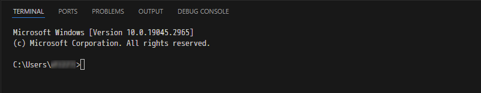
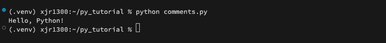
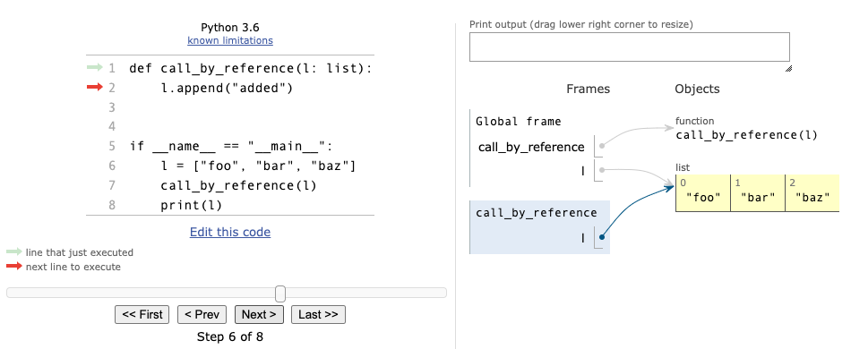

# Pythonの最初のステップ for Windows

- [Pythonの最初のステップ for Windows](#pythonの最初のステップ-for-windows)
  - [Pythonの簡単な説明](#pythonの簡単な説明)
    - [Pythonの特徴](#pythonの特徴)
    - [Pythonの欠点](#pythonの欠点)
      - [プログラムの実行速度が遅い](#プログラムの実行速度が遅い)
      - [明示的に型を示さない](#明示的に型を示さない)
  - [Pythonのインストール](#pythonのインストール)
  - [Visual Studio Code(VSCode)のインストール](#visual-studio-codevscodeのインストール)
  - [Python拡張機能のインストール](#python拡張機能のインストール)
  - [VSCodeのエディタ設定](#vscodeのエディタ設定)
  - [インタープリタの使用](#インタープリタの使用)
  - [チュートリアル用のプロジェクトの作成](#チュートリアル用のプロジェクトの作成)
  - [仮想環境の作成](#仮想環境の作成)
  - [VSCodeで仮想環境を選択](#vscodeで仮想環境を選択)
  - [言語機能の説明](#言語機能の説明)
    - [コメント](#コメント)
    - [データ型](#データ型)
      - [str型（文字列）](#str型文字列)
      - [int型（整数）](#int型整数)
      - [float型（32bit浮動小数点数）](#float型32bit浮動小数点数)
      - [Decimal型（固定小数点数）](#decimal型固定小数点数)
      - [bool型（真偽値）](#bool型真偽値)
      - [list型（リスト）](#list型リスト)
      - [tuple型（タプル）](#tuple型タプル)
      - [dict型（辞書）](#dict型辞書)
      - [set型（集合）](#set型集合)
      - [None（のん）](#noneのん)
    - [変数](#変数)
    - [論理式](#論理式)
    - [関数](#関数)
    - [スコープ](#スコープ)
    - [イミュータブルとミュータブルなデータ型](#イミュータブルとミュータブルなデータ型)
    - [プログラムの制御構造](#プログラムの制御構造)
      - [順次](#順次)
      - [分岐](#分岐)
        - [三項演算子（みたいな制御構造）](#三項演算子みたいな制御構造)
      - [繰り返し](#繰り返し)
      - [例外処理](#例外処理)
      - [再帰](#再帰)
      - [yield（いーるど）](#yieldいーるど)
      - [コンテキストマネージャ](#コンテキストマネージャ)
      - [非同期処理](#非同期処理)
    - [内包表記](#内包表記)
    - [デコレーター](#デコレーター)
  - [外部パッケージの利用](#外部パッケージの利用)
  - [最後に](#最後に)

## Pythonの簡単な説明

### Pythonの特徴

- オープンソース
- コードの記述がシンプルなインタープリタ言語
  - プログラムの実行時にソースコードを機械語に変換する方式
  - コンパイル言語とは異なり、コンパイルの必要がなく、手軽に実行ができる
- Python公式から提供される標準ライブラリが豊富
- 標準ライブラリ以外にも、コミュニティによる多種多様なライブラリ（パッケージ）の開発が活発
  - パッケージは、機械学習、数値計算、画像処理、Web、データベースなど、紹介することが困難なほど多種多様に多く存在
- 最近では、機械学習向けの言語として注目
- Webシステムなど、どのようなプログラムでも記述可能
- 人気のあるプログラミング言語の1つで、人気は`JavaScript`に次いで２位(2024年)

### Pythonの欠点

- プログラムの実行速度が遅い
- 型安全でない、実行する前にプログラムに誤りがあることに気付きにくい
- 明示的に型を示さないため、過去に実装したコードの可読性が低い
- 大規模なプログラムの場合、ソースコードをすべて渡す必要があるなど、可搬性が低い
- OS上で動作するランタイム上で実行されるため、OSなど低水準（機械に近い）な処理は記述不可能

> OS: Operating System、基本ソフトウェア、WindowsやLinuxやmacOSなど

#### プログラムの実行速度が遅い

Pythonはインタープリタ言語であるため、実行時にソースコードを機械語に変換するコストがかかり、コンパイラ言語よりも実行速度が遅くなります。

> 実行速度が遅いにも関わらず、機械学習や画像処理に利用される理由は、**コストの高い処理を`C`言語で記述されたプログラム（ライブラリ）に移譲**して、結果を受け取っているからです。
> また、実行速度に遅さを補うほど、手軽に利用できる**大きな利点があります。**

PythonとRustで0から45までのフィボナッチ数を計算したときの処理時間は次のとおりです。
なお、フィボナッチ数は次のとおり一般化され、その数列は`0, 1, 1, 2, 3, 5, 8, 13, 21, 34, 55, 89, 144, ...`です。
また、`fibonacci(45) = 1,134,903,170`です。

```text
fibonacci(0) = 1
fibonacci(1) = 1
fibonacci(n) = fibonacci(n - 1) + fibonacci(n - 2) (n >= 2)
```

| 言語   | 実行時間(secs) | 備考                   |
| ------ | -------------: | ---------------------- |
| Python |        129.849 | Rustよりも40倍以上遅い |
| Rust   |          3.644 | -                      |

実験で試したコードは次の通りです。

- Pythonのコード

```python
import sys
import time


def fibonacci(n):
    if n == 0:
        return 0
    elif n == 1:
        return 1
    return fibonacci(n - 2) + fibonacci(n - 1)


if __name__ == "__main__":
    args = sys.argv
    if len(args) != 2:
        print("expected one argument", file=sys.stderr)
        sys.exit(1)
    try:
        n = int(args[1])
    except ValueError:
        print("expected an integer number", file=sys.stderr)
        sys.exit(1)

    # フィボナッチ数を求める
    started = time.time()
    value = fibonacci(n)
    finished = time.time()
    elapsed = finished - started
    print(f"fibonacci value: {value} ({elapsed:.3f} seconds)")
```

- Rustのコード

```rust
use anyhow::{anyhow, bail};

fn main() -> anyhow::Result<()> {
    let mut args = std::env::args();
    if args.len() != 2 {
        bail!("expected one argument")
    }
    let _ = args.next();
    let n = args
        .next()
        .unwrap()
        .parse::<u32>()
        .map_err(|e| anyhow!(e))?;

    // フィボナッチ数を求める
    let started = std::time::SystemTime::now();
    let value = fibonacci(n);
    let elapsed = started.elapsed().unwrap();
    let elapsed = elapsed.as_secs_f32();
    println!("fibonacci value: {value} ({elapsed:.3} seconds)");

    Ok(())
}

fn fibonacci(n: u32) -> u32 {
    match n {
        0 => 0,
        1 => 1,
        _ => fibonacci(n - 2) + fibonacci(n - 1),
    }
}
```

> Rustのコードに型を明示していない箇所が多くありますが、型はコンパイラが推論しています。
> Rustの言語サーバーが動作しているVSCodeでは、コンパイラが推論した型を表示する機能があります。
>
> 

#### 明示的に型を示さない

次の関数の引数`n`にどのようなデータを渡せば良いか、関数の実装を確認しないと把握できません。

```python
# pythonで実装したフィボナッチ数の例
# pythonでは、関数の引数と戻り値の型を明示しなくても良い。
def fibonacci(n):
    pass

# pythonはタイプヒントにより、次のように関数を定義できる。
# インタープリタはタイプヒントを無視する。
# def fibonacci(n: int) -> int:
#     pass
#
# `mypy`などの静的型チェッカーを使うことで、実行前に型の不整合を検出できる。
# ただし、正しくタイプヒントで表現することが難しい場合がある。
# 次の場合、型をどのように表現する???
# d = { "a": 42, "b": "foo", "c": 3.47, "d": [1, ["a", "b", 3], "bar"]}
```

rustは関数の引数と戻り値の型を明示しなければなりません。
よって、次の関数には符号なし32ビット整数を引数として渡し、符号なし32ビット整数を返すことが関数（関数のシグネチャ）を確認すればわかります。

```rust
/// rustで実装したフィボナッチ数の例
/// rustでは、関数の引数と戻り値の型を明示しなければならない。
fn fibonacci(n: u32) -> u32 {
    ...
}
```

Pythonの型は実行時に決定されるため、**動的型付き言語**に分類されます。
一方、Rustの型はコンパイル時に決定されるため、**静的型付き言語**に分類されます。

## Pythonのインストール

[Python公式サイト](https://www.python.org/)の[ダウンロードページ](https://www.python.org/downloads/)にWebブラウザでアクセスして、`Download Python 3.x.x`ボタンをクリックします。


最新のPythonのインストーラーを保存することを求められるため、自分のPCにインストーラーを保存します。

Pythonインストーラーのダウンロード完了後、ダウンロードしたインストーラーをダブルクリックして実行します。

`Install Python 3.x.x`画面では、`Add python.exe to PATH`にチェックを入れて、`Install Now`ボタンをクリックします。

> 私の場合、実際には環境変数`PATH`にPythonインタープリタのパスが追加されませんでした。


`Setup was successful`と表示されればPythonのインストールは完了です。
同じ画面の`Close`ボタンをクリックしてインストーラーを終了します。

Pythonが正常にダウンロードされているか確認するために、タスクバーの検索ボックス(Windowsアイコンの右の虫眼鏡)をクリックして、`ここに入力して検索`に`cmd`と入力してコマンドプロンプトを起動します。


コマンドプロンプトの起動後、`python --version`と入力してEnterキーを押します。
インストールしたPythonのバージョンが表示されていれば、Pythonのインストールは成功です。


「内部コマンドまたは外部コマンド、操作可能なプログラムまたはバッチファイルとして認識されません。」などのエラーメッセージが表示された場合は、Pythonインタープリタへのパスが環境変数に設定されていない可能性があります。この場合、次をコマンドプロンプトで実行した後、再度、コマンドプロンプトで`python --version`を実行してください。

> 次はPython3.12の場合です、異なるバージョンをインストールした場合は`Python<version>`の部分を適宜変更してください。

- PowerShellの場合

```ps
 $ENV:Path+=";C:\Users\d12272\AppData\Local\Programs\Python\Python312\Scripts\"
```

- MS-DOSの場合

```dos
set PATH=%PATH%;C:\Users\d12272\AppData\Local\Programs\Python\Python312\Scripts\
```

> 環境変数`PATH`は`OS`が使用する重要な設定の1つです。
> `PATH`は、`OS`がプログラムやコマンドを実行する際に、そのプログラムがどこにあるかを示すリストです。
> このリストには、ディレクトリ（フォルダー）のパスが含まれており、`OS`がそのリストからもt句的のファイルをなどを見つけることができます。
> `PATH`に設定されている値を表示するには、コマンドプロンプトで`echo %PATH%`を実行してください。

## Visual Studio Code(VSCode)のインストール

本チュートリアルでは、Pythonコードの記述を`Visual Studio Code`（以下、VSCode）で行います。

[VSCode公式サイト](https://azure.microsoft.com/ja-jp/products/visual-studio-code)にWebブラウザでアクセスして、`Visual Studio Codeをダウンロードする`ボタンをクリックします。


表示された`Download Visual Studio Code`ページにある`Windows`ボタンをクリックします。
`Windows`ボタンをクリックすると最新のVSCodeのインストーラーの保存を求められるため、自分のPCにインストーラーを保存します。


VSCodeのインストーラーのダウンロード完了後、VSCodeのインストーラーをダブルクリックして実行します。

インストーラーを実行したとき、「このインストーラーは管理者としてVSCodeを実行することを意図していない・・・」などの警告が表示された場合、警告を無視して`OK`ボタンをクリックしてください。

VSCodeのインストーラー画面では、次を入力してください。

- 使用許諾契約書の同意: 同意する
- インストール先の指定: デフォルト
- スタートメニューディレクトリの指定: デフォルト
- 追加タスクの選択
  - アイコンを追加する:
    - デスクトップ上にアイコンを作成する: 任意
  - その他:
    - エクスプローラーのファイルコンテキストメニューに[Codeで開く]アクションを追加する: **チェック**
    - エクスプローラーのディレクトリコンテキストメニューに[Codeで開く]アクションを追加する: **チェック**
    - サポートされているファイルの種類のエディターとして、Codeを登録する: チェック推奨
  - PATHへの追加(再起動後に使用可能): **チェック**
- インストール準備完了
  - `インストール`ボタンをクリック

VSCodeのインストール完了画面が表示された後、同じ画面の`完了`ボタンをクリックして、VSCodeのインストーラーを終了します。

インストーラーの終了後、VSCodeが起動すれば、VSCodeのインストールは成功です。

タスクバーの検索ボックスに`code`と入力してVSCodeが起動できることを確認してください。

また、エクスプローラーでファイルまたはディレクトリをマウスで右クリックして表示されるコンテキストメニューに`Codeで開く`メニューがあること、そのメニューをクリックしたときVSCodeが起動することを確認してください。


## Python拡張機能のインストール

VSCodeで快適にPythonコードを記述するために、VSCodeの画面の左にある`Extensions`をクリックして次の拡張機能をインストールします。

- `Python`: Microsoft社
- `Japanese Language Pack for Visual Studio Code`: Microsoft社
- `indent-rainbow`: oderwat社

上記拡張機能は、`Extensions`の上部にある`Search Extensions in Marketplace`に`python`や`japanese`を入力することで検索できます。
それぞれの拡張機能が見つけた後、その拡張機能の右下にある小さな`Install`をクリックしてそれぞれの拡張機能をインストールしてください。

> 警告: 似たような名前の拡張機能があるため、`Install`をクリックする拡張機能を十分に確認してください。


Python拡張機能をインストールすると`Pylance`と`Python Debugger`も同時にインストールされます。
これらの拡張機能が、Pythonコードを自動で補間や整形したり、デバッグを支援するなど、開発者の実装体験を向上させます。

また、Pythonコードは、条件判断した結果によって実行するコードの範囲や、繰り返し処理するコードの範囲をインデント(字下げ)で表現します。
`indent-rainbow`拡張機能は、Pythonコードのインデントを視覚的にわかりやすく表示する拡張機能です。
なお、上記で説明したインデントした範囲を**ブロック**と呼びます。


## VSCodeのエディタ設定

Pythonでコードを記述する場合、次のようなコーディングスタイルがあり[PEP8](https://peps.python.org/pep-0008/)として公開されています。

- インデントはスペース4つ
- 文字エンコーディングはUTF-8

なお、改行コードは、Windowsにおいて`CRLF(0x0D0A)`、LinuxやMacでは`LF(0x0A)`が標準です。
`PEP8`に定められてはいませんが、本チュートリアルでは改行コードを`LF`に統一します。

> 共同開発する場合は、コーディングスタイルを統一することが重要です。

上記コーディングスタイルを自然に遵守できるように、VSCodeを次のとおり設定します。

1. VSCodeで`Ctrl + Shift + P`を押して、コマンドパレットを表示します。
2. コマンドパレットに`open user settings`と入力していくと、コマンドの候補がリストされるため`Preferences: Open User Settings`をマウスで選択します。
3. `Settings`タブの上部にあるテキスト入力欄に`editor: tab size`と入力して、表示された`Editor: Tab Size`の値を`4`に変更します。
4. 同様に`editor: insert spaces`と入力して、表示された`Editor: Insert Spaces`をチェックします。
5. 次に`files: encoding`と入力して、表示された`Files: Encoding`に`UTF-8`を入力します。
6. 最後に`files: eol`と入力して、表示された`Files: Eol`に`\n`を入力します。

`Editor: Insert Spaces`をチェックすると、`Tab`キーを押したときにスペースが挿入されます。
挿入されるスペースの数は、`Editor: Tab Size`で設定した値になります。
また、`eol`は`end of line(s)`の略です。

VSCodeの設定は即座に反映されるため、`OK`ボタンをクリックするなどのアクションは必要ありません。

- `Preferences: Open User Settings`


- `Editor: Tab Size`


- `Editor: Insert Spaces`


- `Files: Eol`


- `Files: Encoding`


## インタープリタの使用

Pythonのインタープリタは、ターミナルから使用します(すでにターミナルが起動しているかもしれません)。
VSCodeの[Terminal]メニューから[New Terminal]を選択すると、VSCodeの下部にターミナルが表示されます(`Ctrl + Shift + @`)。

- PowerShellの場合


- コマンドプロンプト(MS-DOS)の場合



ターミナルに`python`と入力して`Enter`キーを押して、インタープリタを起動ます。
`>>>`(プロンプト)が表示されれば、インタープリタが起動しています。

- PowerShellの場合

```ps
PS C:\Users\xxx> python
Python 3.12.3 (tags/v3.12.3:f6650f9, Apr  9 2024, 14:05:25) [MSC v.1938 64 bit (AMD64)] on win32
Type "help", "copyright", "credits" or "license" for more information.
>>>
```

- MS-DOSの場合

```dos
C:\Users\xxx> python
Python 3.12.3 (tags/v3.12.3:f6650f9, Apr  9 2024, 14:05:25) [MSC v.1938 64 bit (AMD64)] on win32
Type "help", "copyright", "credits" or "license" for more information.
>>>
```

インタープリタに次を1行ずつ入力して、`Enter`キーを押してください。
入力した結果、インタープリタがどのように応答するか確認してください。

```python
print("Hello, Python!")
1 + 2
3 * 6
12 / 4
type(12 / 4)
12 // 4
type(12 // 4)
13 / 4
13 // 4
13 % 4
4**2
10 + 10.5
"hello, " + "world!"
type(43)
type("43")
a = 43
print(f"a = {a}")
for n in range(10):
    print(n)

import math
pi = math.pi
pi
math.sin(pi)
math.sin(math.pi)
def fibonacci(n):
    if n == 0:
        return 0
    elif n == 1:
        return 1
    return fibonacci(n - 1) + fibonacci(n - 2)

fibonacci(10)
exit()
```

`range`関数は、指定した数値までの整数を*生み出し*ます。

`for n in range(10):`の行を入力した後、`Enter`キーを押すと、次の行が`...`に変わります。
`for`文が実行するブロックを表現する必要があるため、`Tab`キーを押した後`print(n)`と入力して`Enter`キーを2回押します。

同様に、`def fibonacci(n):`と入力して`Enter`キーを押すと、次の行が`...`に変わります。
関数のブロックを表現する必要があるため、`Tab`キーを押した後`if n == 0:`と入力して`Enter`キーを押します。
それぞれの`return`文を入力する前に`Taq`キーを2回押す必要があります。
`fibonacci`関数の最後の`return`文の後は、`Enter`キーを2回押すと`...`が消えて、`fibonacci`関数が定義され、次の行が`>>>`に変わります。

> `...`が表示されている場合、ブロック内のコードを入力する必要があることを示しています。

インタープリタに`exit()`と入力して`Enter`キーを押すと、Pythonのインタープリタが終了します(`Ctrl + D`でも終了できます)。

## チュートリアル用のプロジェクトの作成

1. エクスプローラーを開き、例えば`C:\Users\<user-identifier>\Documents`ディレクトリ(フォルダ、エクスプローラーでは`PC > ドキュメント`と表示されます)に`py_tutorial`ディレクトリを作成します。
2. 作成した`py_tutorial`ディレクトリを右クリックして、表示されたコンテキストメニューから`Codeで開く`を選択すると、`py_tutorial`をカレントディレクトリとして開いた状態でVSCodeが起動します。

`Do you trust the authors of the files in this folder?`と表示された場合、**とりあえず信用する**ため、`Truest the authors of all file in the parent folder 'Documents'`をチェックして、`Yes, I trust the authors`ボタンをクリックしてください。

> これは、[CVE-2020-1416](https://cve.mitre.org/cgi-bin/cvename.cgi?name=CVE-2020-1416)に対するセキュリティ対策です。
> VSCode(とVisual Studio)は、ソフトウェアの依存関係を読み込むときに権限が昇格する脆弱性があり、悪意のあるプログラムが特権を取得することで、被害を受ける可能性があります。

以降`py_tutorial`ディレクトリを**プロジェクトディレクトリ**と呼びます。
また、ファイルやディレクトリのパスは、カレントディレクトリからの相対パスで表現します。

```text
py_tutorial
├─cart
│  └─templates
├─coupons
│  └─migrations
└─locale
    └─es
        └─LC_MESSAGES
        └─payment
```

`cart`のパスは、`cart`または`.\cart`と表現します。
`LC_MESSAGES`のパスは、`locale\es\LC_MESSAGES`または`.\locale\es\LC_MESSAGES`と表現します。
パスの最初の文字の`.`は現在のディレクトリを示しており、つまり`py_tutorial`ディレクトリです。
ただし、`cart`ディレクトリを`py_tutorial\cart`と表現できません。これは存在しない`py_tutorial\py_tutorial\cart`を示します。

## 仮想環境の作成

先ほどインストールしたPythonは、`OS`に直接インストールされています。

今後、多分、多くのプロジェクトで多くのプログラムを実装することになります。
それぞれのプロジェクトでは、様々なパッケージを導入して、プログラムの機能や開発速度を向上させます。

ここで、新しい機能が追加された最新バージョンのパッケージを利用したいと考えたとします。
しかし、あるプロジェクトが想定しているパッケージのバージョンと、最新バージョンに互換性がない場合、最新バージョンを導入することが難しい場合があります。

> セマンティックバージョニングを採用している場合、バージョン番号のメジャーバージョンの増加(1.0.0 -> 2.0.0)は、後方互換性を維持していません。
> セマンティックバージョニングにおけるバージョン番号は、`major.minor.patch`の3つの数字で構成されています。
> マイナーバージョンの増加は、後方互換性を維持した機能追加です。
> パッチバージョンの増加は、後方互換性を維持したバグ修正です。

このため、Pythonのプログラムを実装する場合、そのプロジェクトで導入するパッケージのバージョンが、OSに直接インストールされたPythonに影響を与えないように**別の環境**を用意することが普通です。
この別の環境のことを**Python仮想環境**または単に**仮想環境**と呼びます。

本チュートリアル用の仮想環境を作成して、作成した仮想環境を次の通り有効にします。
1行目は、プロジェクトディレクトリ（カレントディレクトリ）に`.venv`ディレクトリを作成して、`.venv`ディレクトリに仮想環境を作成する`venv`コマンドです。
2行目は、作成した仮想環境を有効にするコマンドです。

> ファイルやディレクトリの名前の最初に`.`が付いている場合、それらは隠しファイルであったり、隠しディレクトリです。

コマンドの実行後、ターミナルのプロンプトに`(.venv)`が表示されていれば、仮想環境が有効になっています。

- PowerShellの場合

```ps
python -m venv .venv
.\.venv\Scripts\Activate.ps1
```

- MS-DOSの場合

```dos
python -m venv .venv
.\.venv\Scripts\activate.bat
```

## VSCodeで仮想環境を選択

Python拡張機能が本チュートリアル用の仮想環境を認識できるように、次の通りVSCodeを設定します。

1. `Ctrl + Shit + P`を押してコマンドパレットを表示します。
2. 表示されたコマンドパレットで`python: select interpreter`と入力して、表示されたリストから`Python: Select Interpreter`を選択します。
3. 選択可能な仮想環境（OSにインストールされたPythonを含む）がリストされるため、表示された候補のパスを確認して`Python x.x.x ('.venv': venv) .\venv\Scripts\python.exe - Recommended`を選択します。


「Pythonの仮想環境の有効化に成功したけど、ターミナルのプロンプトのインジケーターに"(.venv)"と表示されないかもしれないよ」的なメッセージが表示されるかもしれません。
その場合、単にそのメッセージを閉じるか、`Don't show again`をクリックしてください。
`Don't show again`ボタンの下に`Python x.x.x ('.venv': venv)`と表示されていれば、仮想環境が有効になっています。


## 言語機能の説明

### コメント

VSCodeのエクスプローラーにある`New File`ボタンをクリックして、新しく作成するファイルの名前に`comments.py`と入力します。
次に示すように`comments.py`ファイルが配置されていない場合、プロジェクトディレクトリ直下に`comments.py`ファイルが作成されていない可能性があります。


`comments.py`ファイルに次を入力して、ファイルを保存してください。

```python
# これはコメントです。

print("Hello, Python!")  # `#`から右はコメントです。

"""
ダブルクォート3つで上下を挟んだ場合、ダブルクォートを含めてすべてコメントです。
このコメントの記述は、複数行のコメントを記述できます。
"""

'''
シングルクォート3つで上下を挟んだ場合、効果はダブルクォート3つと同じです。
'''
```

ターミナルで次を実行すると、ターミナル（標準出力）に`Hello, Python!`が表示されます。
コメント部分はプログラムの実行に影響を与えず、インタープリタがコメントとして認識していることがわかります。



### データ型

Pythonで扱えるデータ型の一部を次に示します。

- `str`: 文字列
- `int`: 整数
- `float`: 浮動小数点数
- `Decimal`: 固定小数点数
- `bool`: 真偽値
- `list`: リスト
- `tuple`: タプル
- `dict`: 辞書
- `set`: 集合
- `None`

`str`、`int`、`float`、`Decimal`、`bool`、`None`は、1つの値を表現します。
`list`、`tuple`、`dict`、`set`は、複数の値を内部に保持するコレクションを表現します。

#### str型（文字列）

文字列を扱う型です。
表現したい文字列をダブルクォート(`"`)またはシングルクォート(`'`)で挟んで表現します。
文字列を分割、文字列を検索するなど文字列を操作する便利な機能（メソッド）が多く提供されています。

> メソッドは`obj.method(...)`の形式で呼び出します。

```python
>>> "Hello, Python!"
'Hello, Python!'
>>> 'Hello, Python!'
'Hello, Python!'
>>> "Hello, " + "Python!"
'Hello, Python!'
>>>
>>> "foo, bar, baz, qux, quux".split(",")
['foo', ' bar', ' baz', ' qux', ' quux']
```

#### int型（整数）

整数を表現する型です。
他のプログラミング言語と異なり、メモリを割り当てることが可能な限り、大きな正負の整数を表現できます。

> 以前、話題となった`8÷2(2+2)`の計算結果は、`8 // 2 * (2 + 2)`と表現され、返ってくる値を`16`で、括弧を優先して左から順に評価します。
> なお、`//`演算子は、整数の除算を行い、結果を整数で返します。
> また、`/`演算子は、整数同士の計算でも、結果を浮動小数点数で返します。

```python
>>> 8 // 2 * (2 + 2)
16
>>> 8 / 2 * (2 + 2)
16.0
```

#### float型（32bit浮動小数点数）

小数を含む数値を扱う型です。
緯度／経度などの座標値を扱うときなどに使用されます。
浮動小数点数は、符号、仮数部、指数部で表現されるため、有理数の中で正確に表現できない値がある、つまり誤差があることに注意してください。
2の乗数で表現できる数値の倍数は正確に表現できます。

```text
64bit浮動小数点数の値(IEEE754) = 符号 * 2^(指数部 - 1023) * 1.仮数部
                                   ^^^^^^^^^^^^^^^^  ^^^^^^^^
                                   2の乗数             倍数
0.5 = 1 *   2^(1022 - 1023) * 1.0
      ^       ^^^^^^^^^^^^^     ^
      符号     指数部             仮数部
```

```python
>>> 0.1 + 0.1 + 0.1
0.30000000000000004
>>> 0.5 + 0.5 + 0.5
1.5
```

したがって、**絶対にfloat型でお金を扱わない**ようにしてください。
お金を扱う場合は、次に説明する`decimal.Decimal`型を使用してください。

また、有理数を扱う`fractions.Fraction`型もあります。

```python
>>> from fractions import Fraction
>>> f = Fraction(1/10) + Fraction(1/10) + Fraction(1/10)
>>> f
Fraction(10808639105689191, 36028797018963968)
>>> float(f)
0.30000000000000004
```

#### Decimal型（固定小数点数）

十進数を正確に表現できる型(`decimal.Decimal`)です。
小学校で習った算術と同じように動作します。

```python
>>> from decimal import Decimal
>>> Decimal("0.1") + Decimal("0.1") + Decimal("0.1")
Decimal('0.3')
```

`Decimal("0.1")`などと**値を文字列で与える**ことに注意してください。
`Decimal(0.1)`とすると、浮動小数点数の誤差が発生します。

```python
Decimal(0.1)
Decimal('0.1000000000000000055511151231257827021181583404541015625')
```

#### bool型（真偽値）

`True`または`False`で真偽値を表現する型です。

```python
>>> True
True
>>> False
False
```

#### list型（リスト）

複数のデータを順序付けで格納する型で、プログラムで頻繁に使用されます。
Pythonの配列(`array.array`)や他の言語の配列と異なり、異なるデータ型の要素を格納できます。

**インデックス**と呼ばれる要素の位置を指定して、`values[3]`のように要素を取得できます。
listの最初の要素のインデックスは`0`です。
さらに、インデックスは負の値を指定して、末尾からの位置を指定できます。
また、インデックスの範囲を指定してリストの要素の一部を取得する**スライス**と呼ばれる操作ができます。

listの要素を取得、追加、削除する機能（メソッド）が提供されています。
末尾への要素の追加は定数時間(`O(1)`)ですが、先頭または中間への要素の追加は線形時間(`O(n)`)です。

> つまり、要素の数が多くなるほど線形に時間がかかることを示します。

頻繁に先頭要素を追加または削除する場合は、`collections.deque`（でっく、両端キュー）を使用します。

listは次のように構築できます。

```python
[1, 2, 3, 4, 5]
>>> ["foo", "bar", "baz", "qux", "quux"]
['foo', 'bar', 'baz', 'qux', 'quux']
>>> [1, "foo", 3.14, True, [1, 2, 3]]
[1, 'foo', 3.14, True, [1, 2, 3]]
```

listの要素を取得、追加、変更、削除する方法を次に示します。

```python
>>> l = list(range(10))
>>> l
[0, 1, 2, 3, 4, 5, 6, 7, 8, 9]
>>> l[0]
0
>>> l[1]
1
>>> l[-1]
9
>>> l[-2]
8
>>> l[3:6]
[3, 4, 5]
>>> l[:3]
[0, 1, 2]
>>> l[6:]
[6, 7, 8, 9]
>>> l[-7:-4]
[3, 4, 5]
>>>
>>> l.append(10)
>>> l
[0, 1, 2, 3, 4, 5, 6, 7, 8, 9, 10]
>>> l.pop()
10
>>> l
[0, 1, 2, 3, 4, 5, 6, 7, 8, 9]
>>> l.insert(0, -1)
>>> l
[-1, 0, 1, 2, 3, 4, 5, 6, 7, 8, 9]
>>> l[1] = 10
>>> l
[-1, 10, 1, 2, 3, 4, 5, 6, 7, 8, 9]
>>> del l[1]
>>> l
[-1, 1, 2, 3, 4, 5, 6, 7, 8, 9]
>>> l.remove(3)
>>> l
[-1, 1, 2, 4, 5, 6, 7, 8, 9]
```

リストの値を順に取得する場合は、次のように`for`文を使用します。
また、範囲外の位置（インデックス）を指定して要素を取得しようとすると、`IndexError`が発生します。

```python
>>> values = list(range(5))
>>> for value in values:
...     print(value)
...
0
1
2
3
4
>>>
>>> values[5]
Traceback (most recent call last):
  File "<stdin>", line 1, in <module>
IndexError: list index out of range
```

listには異なる型を格納できますが、その場合、格納する要素には何らかの区分があると考えられます。
その場合、list型ではなくdict型を使用することを検討してください。

#### tuple型（タプル）

複数の要素を順序付けて格納する型です。
list型と同様に異なる型を格納できますが、要素を変更できません。

> listで異なる型を格納することはあまり推奨できませんが、tupleは不変であるため、どの位置に何が格納されているか構築時に決まります。
> よって、異なる型を格納するためにtuple型を利用することは推奨できます。

```python
>>> values1 = (0, 1, 2, 3, 4)
>>> values1
(0, 1, 2, 3, 4)
>>> values2 = tuple(range(5))
>>> values2
(0, 1, 2, 3, 4)
>>>
>>> for value in values1:
...     print(value)
...
0
1
2
3
4
>>>
>>> values[5]
Traceback (most recent call last):
  File "<stdin>", line 1, in <module>
IndexError: tuple index out of range
```

#### dict型（辞書）

キーと値のペアを格納するデータ型で、プログラムで頻繁に使用されます。
キーには、通常strが使用されますが、ハッシュ化が可能なデータ型であればキーに使用できます。
値にはどのようなデータ型も格納できます。
dictにキーと値を追加するとき、すでに同じキーが存在する場合、値が新しい値で上書きされます。
値を取得するときに存在しないキーを指定した場合、`KeyError`が発生します。

dictからキーを使用した値の取り出しは、定数時間(`O(1)`)です。

> ハッシュ化可能なデータ型は、`__hash__`メソッドが実装されています。
> str、int、tupleは、`__hash__`メソッドが実装されているため、キーに利用できます。

```python
>>> d = {"a": 1, "b": 3.14, "c": "hello"}
>>> d
{'a': 1, 'b': 3.14, 'c': 'hello'}
>>> d["b"]
3.14
>>> d["e"] = "foo"
>>> d
{'a': 1, 'b': 3.14, 'c': 'hello', 'e': 'foo'}
>>> del d["e"]
>>> d
{'a': 1, 'b': 3.14, 'c': 'hello'}
>>> d["c"] = "python"
>>> d
{'a': 1, 'b': 3.14, 'c': 'python'}
>>>
>>> d["e"]
Traceback (most recent call last):
  File "<stdin>", line 1, in <module>
KeyError: 'e'
>>>
>>> for key, value in d.items():
...     print(key, value)
...
a 1
b 3.14
c hello
```

#### set型（集合）

重複した値を格納できないデータ型で、和集合、差集合、積集合などの集合演算ができます。
listなどのコレクションから重複した値を取り除く場合に便利です。

```python
>>> s1 = set()
>>> s1.add(0)
>>> s1.add(1)
>>> s1.add(2)
>>> s1
{0, 1, 2}
>>> s2 = {0, 1, 2}
>>> s2
{0, 1, 2}
>>> s2.add(2)
>>> s2
{0, 1, 2}
>>>
>>> l = [0, 0, 3, 6, 7, 8, 9, 7, 5, 5]
>>> s3 = set(l)
>>> s3
{0, 3, 5, 6, 7, 8, 9}
```

#### None（のん）

値または参照するデータがないことを示すデータ型です。

`None`と同様な概念である`null参照`を発明したイギリスの計算機科学者である[アントニー・ホーア](https://ja.wikipedia.org/wiki/%E3%82%A2%E3%83%B3%E3%83%88%E3%83%8B%E3%83%BC%E3%83%BB%E3%83%9B%E3%83%BC%E3%82%A2)氏は、`null参照`の発明を**10億ドルの失敗**と後悔して、謝罪もしています。

> それは10億ドルにも相当する私の誤りだ。
> null参照を発明したのは1965年のことだった。
> 当時、私はオブジェクト指向言語(ALGOL W)における参照のための包括的型システムを設計していた。
> 目標は、コンパイラでの自動チェックで全ての参照が完全に安全であることを保証することだった。
> しかし、私は単にそれが容易だというだけで、無効な参照を含める誘惑に抵抗できなかった。
> これは、後に数え切れない過ち、脆弱性、システムクラッシュを引き起こし、過去40年間で10億ドル相当の苦痛と損害を引き起こしたとみられる。

Pythonの言語仕様として`None`があり、`None`を使用しないで開発することは難しい場合があります。
`None`を使用する場合は、上記に留意して、可能な限り安全に使用することをお勧めします。

### 変数

Pythonにおける変数とは、データをメモリに格納するときに、そのデータの位置（メモリアドレス）を示すラベルのようなものです。

Python Tutor: Visualize code in Python, JavaScript, C, C++, and Java: <https://pythontutor.com/render.html#mode=edit>


次の動画を参照して、変数がメモリに割り当てられる様子を確認してください。
ただし、実際のメモリの割り当て状況を示しているわけではないため、概念として理解してください。

変数の可視化動画:
<https://dainichiconsul.box.com/s/kgq034fe2orsvoygvp4qb14x9exsqmjh>

### 論理式

論理式は、真偽値を返す式で、主に`if`、`for`、`while`文などの条件式として使用されます。

- `x == y`: xとyが等しい場合、`True`を返します。
- `x != y`: xとyが等しくない場合、`True`を返します。
- `x > y`: xがyより大きい場合、`True`を返します。
- `x < y`: xがyより小さい場合、`True`を返します。
- `x >= y`: xがy以上の場合、`True`を返します。
- `x <= y`: xがy以下の場合、`True`を返します。
- `x is y`: xとyが同じオブジェクトである場合、`True`を返します。
- `x is not y`: xとyが異なるオブジェクトである場合、`True`を返します。
- `x in y`: xがyに含まれる場合、`True`を返します。
- `x not in y`: xがyに含まれない場合、`True`を返します。
- `not x`: xが`False`の場合、`True`を返します。
- `x and y`: xとyが`True`の場合、`True`を返します。
- `x or y`: xまたはyが`True`の場合、`True`を返します。
- `x is None`: xが`None`の場合、`True`を返します。
- `x is not None`: xが`None`でない場合、`True`を返します。

否定を含む論理式を多用しない方が、プログラムの可読性が向上します。
否定を多く含む論理式になった場合は、[ドモルガンの法則](https://manabitimes.jp/math/897)を使用して、否定を除去することを検討してください。

### 関数

関数は、ある処理を実行するための一連の手続きをまとめて、名前を付けたものです。
Pythonは、標準で膨大な便利な関数を提供しています。

また、プログラムが複雑になってくると、大きな処理の流れを記述する部分と、細かな処理をする部分を関数に分割することで、プログラムの見通しが良くなり、バグを早く見つけることができます。

プロジェクトディレクトリに、`functions1.py`ファイルを作成して、次のコードを入力してください。

```python
def main():
    foo()
    bar()
    baz()


def foo():
    print("foo")


def bar():
    print("bar")


def baz():
    print("baz")


if __name__ == "__main__":
    main()
```

そして、ターミナルに次を入力して、`functions1.py`ファイルを実行してください。

```ps
python functions1.py
```

> `if __name__ == "__main__":`について
>
> `python foo.py`のようにPythonのファイルを実行したとき、Pythonは自動的に`__name__`変数に`__main__`という値を設定します。
> これを利用して、Pythonファイルをライブラリとしてインポートして、上記で言えば`foo`、`bar`、`baz`関数のみインポートして、
> `if __name__ == "__main__":`ブロックのコードが実行されないようにします。

関数は値を受け取り、値を返すことができます。
関数に渡す値を**引数**、関数から返ってくる値を**戻り値**と呼びます。

> 呼び出し側で関数に渡した引数を**実引数**、関数で受け取った引数を**仮引数**と区別する場合があります。

プロジェクトディレクトリに、`functions2.py`ファイルを作成して、次のコードを入力してください。

```python
def add(x, y):
    return x + y


def sub(x, y):
    return x - y


def mul(x, y):
    return x * y

if __name__ == "__main__":
    x = add(2, 3)
    print(f"x = {x}")
    y = sub(2, 3)
    print(f"y = {y}")
    print(f"z = {mul(2, 3)}")
```

関数の引数に渡された値は、その関数で行われた処理の影響を受ける引数の型と、影響を受けない引数の型があります。
関数の引数は、値をコピーして関数に渡されます。
しかし、データ型によって値そのものがコピーされるか、値が格納されている場所（メモリアドレス）がコピーされるかが異なります。

値そのものがコピーされることを**値渡し**、値が格納されている場所がコピーされることを**参照渡し**と呼びます。

int型、float型、str型は**値渡し**です。

プロジェクトディレクトリに、`functions3.py`ファイルを作成して、次のコードを入力／実行して出力される値が**変更されていない**ことを確認してください。

`+=`演算子は、現在の値に右辺の値を加算して、その結果を左辺の変数に格納します。
`n += 10`は、`n = n + 10`と同じです。

```python
def call_by_int_value(n: int):
    n += 10


def call_by_float_value(f: float):
    f += 10


def call_by_str_value(s: str):
    # 文字列の連結
    s = s + "asdf"


if __name__ == "__main__":
    n = 1
    call_by_int_value(1)
    print(f"n = {n}")

    f = 3.14
    call_by_float_value(f)
    print(f"f = {f}")

    s = "1234"
    call_by_str_value(s)
    print(f"s = '{s}'")
```


次の動画を確認して、引数の値渡しのイメージを掴んでください。

引数の値渡し動画:
<https://dainichiconsul.box.com/s/i7in8bfzrmhga45a9fu9moy8l7i3matr>

list型、dict型、set型は**参照渡し**です。

プロジェクトディレクトリに、`functions4.py`ファイルを作成して、次のコードを入力／実行して出力される値が**変更されている**ことを確認してください。

```python
def call_by_reference(l: list):
    l.append("added")


if __name__ == "__main__":
    l = ["foo", "bar", "baz"]
    call_by_reference(l)
    print(l)

```



次の動画を確認して、引数の参照渡しのイメージを掴んでください。

引数の参照渡し動画:
<https://dainichiconsul.box.com/s/2naryjv29n9zmedqwfwn75jehkqza8fq>

### スコープ

**スコープ**とは、変数や関数が扱える有効な範囲を示します。
関数内で宣言された変数は**ローカル変数**で、ローカルが示す通りその関数内でのみ有効です。
ローカル変数は、その変数が宣言されたスコープから外れると、Pythonの**ガベージコレクタ**によって回収されて破棄されます。
Pythonは、この**ガベージコレクション**機能によって、メモリ領域が枯渇することを防いでいます。

Pythonでスコープは**関数ブロック**によって決定されます。

```python
def foo():
    a = 10
    print("foo: ", a)

    # 関数内で別の関数を定義
    def bar():
        b = 11
        print("bar: ", b)

    bar()


if __name__ == "__main__":
    foo()

    def baz():
        c = 12
        print("bar: ", c)

    baz()
```

上記コードで宣言された変数や関数のスコープが、どの範囲で有効になっているかを、次の動画で確認してください。
変数や関数がスコープから外れると、削除されることを確認してください。

変数と関数のスコープの動画:
<https://dainichiconsul.box.com/s/9n2uw6pqdnq13chpzddvvwg3c1ui6vbd>

プロジェクトディレクトリに`scopes1.py`ファイルを作成して、次のコードを入力／実行してください。
スコープの外れた変数を出力する`print`関数をコメントアウトしていおり、プログラムはエラーなしで実行されます。

しかし、それぞれの`print`関数をコメントアウトを解除して実行すると、エラー（例外）が発生します。
実際に片方ずつ`print`関数のコメントを解除及び実行して、エラー（例外）が発生することを確認してください。

```python
def foo():
    x = 1
    print("I have x in foo: ", x)


if __name__ == "__main__":
    # 変数`x`は`foo`関数のスコープで宣言されているため参照できない
    # print(x)  # `print`文の`#`を削除すると、実行時にエラー（例外）が発生

    # `foo`関数はモジュール（ファイル）レベルで宣言されているためスコープ内
    foo()

    if True:
        y = 2

    # 知らんかった
    # 右に記述したことは誤り: 変数`y`は`if`文のスコープで宣言されているため参照できない
    print(y)

    if True:
        # 変数`z`はさらにネストした`if`文で宣言されているため参照できない
        # print(z)
        if True:
            z = 10
```

関数の外で宣言された**グローバル変数**は、そのファイル全体をスコープとするグローバルスコープを持ちます。
関数内で変更不可能（**イミュータブル**）なデータ型のグローバル変数を利用するためには、そのグローバル変数を利用する前に、`global`キーワードでグローバル変数を利用することを宣言する必要があります。

プロジェクトディレクトリに`scopes2.py`ファイルを作成して、次のコードを入力／実行してください。

```python
import sys

x = 100


def foo():
    # 関数内でグローバル変数の参照を試行
    # しかし、変数がローカルスコープで束縛されていない（宣言されていない）ことを
    # 示す`UnboundLocalError`例外が発生するため、例外処理してプログラムが
    # クラッシュすることを避ける
    try:
        print("x in foo func:", x)
    except UnboundLocalError as e:
        print(f"UnboundLocalError: {e}", file=sys.stderr)

    # 関数内でグローバル変数と同じ名前の変数を宣言
    # この変数`x`は`foo`関数のローカル変数であり、`foo`関数の終了とともに破棄される。
    # また、グローバル変数`x`は、見えなくなる
    x = 300
    print("x is a local variable in foo func:", x)


def bar():
    # `x`はグローバル変数であることを宣言
    global x

    # 関数内でグローバル変数`x`を参照
    print("x in bar func:", x)

    # 関数内でグローバル変数`x`の値を変更
    x = 400
    print("x was changed in bar func:", x)


if __name__ == "__main__":
    # 関数の外でグローバル変数`x`を参照
    print("x:", x)

    # 関数の外でグローバル変数`x`の値を変更
    x = 200
    print("x after changing:", x)

    print("\n--- go to foo func ---")
    foo()
    print("--- return from foo func ---\n")

    print("x:", x)

    print("\n--- go to bar func ---")
    bar()
    print("--- return from bar func ---\n")

    print("x:", x)

    # グローバル変数`x`が400でない場合、プログラムがクラッシュ
    assert x == 400
```

グローバル変数の使用はプログラムが複雑になると、プログラムの見通しが悪くなるため、避けることが推奨されます。
実際にグローバル変数を使用する場面は少ないです。
変数を宣言後、関数の引数として渡すことを推奨します。

> Pythonは、`if`、`for`などほとんどの制御文でスコープを形成せず、関数のみ（内包表記も）スコープを形成するなど独特です。
> ほとんどの言語では、すべての制御文（式）でスコープを形成するため、Pythonのスコープを意識した変数の利用は、混乱の元になるため、避けることが推奨されます。

```python
import sys


def print_exception(e: Exception) -> None:
    print(f"{e.__class__.__name__}: {e}", file=sys.stderr)


# `if`文
if True:
    a = 1
try:
    print(a)
except UnboundLocalError as e:
    print_exception(e)

# `for`文
for _ in range(5):
    b = 2
try:
    print(b)
except Exception as e:
    print_exception(e)

# `while`文
i = 0
while i < 3:
    c = 3
    i += 1
try:
    print(c)
except Exception as e:
    print_exception(e)

# 例外処理(tryブロック)
try:
    f = 4
except:
    pass
try:
    print(f)
except Exception as e:
    print_exception(e)

# 例外処理(exceptブロック)
try:
    raise Exception
except:
    g = 5
try:
    print(g)
except Exception as e:
    print_exception(e)


# コンテキストマネージャ
with open("scopes3.py", "rt") as f:
    j = 6
try:
    print(j)
except Exception as e:
    print_exception(e)


# 関数
def func() -> None:
    h = 7


try:
    print(h)
except Exception as e:
    print_exception(e)
```

- 上記スクリプトの実行結果

```text
1
2
3
4
5
6
NameError: name 'h' is not defined
```

### イミュータブルとミュータブルなデータ型

Pythonのデータ型は、**イミュータブル**と**ミュータブル**に分類され、それぞれ**変更不可**、**変更可能**を意味します。

- イミュータブルなデータ型
  - bool、int、float、complex（複素数）、str、tupleなど
- ミュータブルなデータ型
  - list、dict、setなど

ミュータブルなデータ型のグローバル変数を関数内で利用するとき、グローバル変数を利用する前の`global`宣言は必要ありません。

これまでの例では、int型の変数に対して算術演算をして、変数の値を変更してきました。
しかし、Pythonにおいて計算結果は、演算前の変数のメモリ位置に保存されるのではなく、新しいメモリ位置に計算結果が格納され、それをその変数で参照できるように動作します。

ターミナルでインタープリタを起動して、次を確認してください。

> `id`関数の実行結果は、実行する環境または実行するたびに異なります。

```python
>>> a = 43
>>> hex(id(a))
'0x101af9320'
>>>
>>> a += 1
>>> hex(id(a))
'0x101af9340'
>>> a
44
>>>
>>> s = "0123"
>>> hex(id(s))
'0x100d16670'
>>> s += "asdf"
>>> hex(id(s))
'0x100d5ecf0'
>>> s
'0123asdf'
```

Pythonの標準の動作環境（ランタイム）であるCPythonは、`id`関数で変数のメモリ位置を確認できます。
演算前の変数`a`のメモリ位置は16進数で`0x101af9320`でしたが、演算後の変数`a`のメモリ位置は`0x101af9340`に変更されています。
したがって、演算前に`a`という**ラベル**で参照されていたメモリ位置のデータ（バイト列）は変更されておらず、int型はイミュータブルです。
これはstr型も同様です。

dict型は、int型やstr型と異なり**ミュータブル**です。

```python
>>> d = {}
>>> hex(id(d))
'0x100d0f280'
>>>
>>> d["foo"] = 1
>>> hex(id(d))
'0x100d0f280'
>>> d
{'foo': 1}
```

要素なしで作成した辞書`d`のメモリ位置は`0x100d0f280`で、要素を追加した後もメモリ位置は変更されていません。
よって、dict型はミュータブルです。

> 実は、Pythonは、イミュータブルな型について、他の言語とはさらに異なる動作をします。
> 例えば、イミュータブルな型の同じ値を持つ変数を2つ宣言したとき、効率性を求めてその変数は同じメモリ位置を示します。
> 異なる値を持ったとき、初めて別のメモリ位置を示します。
>
> ミュータブルな型は、内容が同じでも異なるメモリ位置を示します。

```python
>>> a = 43
>>> b = 43
>>> id(a) == id(b)
True
>>> b += 1
>>> a
43
>>> b
44
>>> id(a) == id(b)
False
>>>
>>> x = "abc"
>>> y = "abc"
>>> id(x) == id(y)
True
>>> y += "d"
>>> id(x) == id(y)
False
>>>
>>> d1 = {}
>>> d2 = {}
>>> id(d1) == id(d2)
False
```

### プログラムの制御構造

Pythonにおけるプログラムの制御構造には、次のようなものがあります（制御構造と言えないものも含まれています）。

- 順次
- 分岐
  - 三項演算子
- 繰り返し
- 例外処理
- 再帰
- yield
- コンテキストマネージャ
- 非同期処理

#### 順次

コードの上から下に順番に実行する制御構造です。

#### 分岐

条件によって、プログラムの実行経路を変更する制御構造です。
Pythonでは`if`文を使用して、条件によって実行経路を変更します。
`if`文と`elif`文で条件を複数指定した場合、条件が成立した最初のブロックが実行され、他のブロックは無視されます。

```python
# パターン1: 条件が成立したときに実行したいコードがある場合
if 条件:
    条件が成立したときに実行したいコード

# パターン2: 条件が成立したとき、条件が成立しなかったときに実行したいコードがある場合
if 条件:
    条件が成立したときに実行したいコード
else:
    条件が成立しなかったときに実行したいコード

# パターン3: 条件が複数あり、それぞれの条件に対して実行したいコードがある場合
if 条件1:
    条件1が成立したときに実行したいコード
elif 条件2:
    条件2が成立したときに実行したいコード
elif 条件3:
    条件3が成立したときに実行したいコード
...
elif 条件n:
    条件nが成立したときに実行したいコード

# パターン4: 条件が複数あり、それぞれの条件に対して実行したいコードがあり、
# すべての条件が成立しなかったときに実行したいコードがある場合
if 条件1:
    条件1が成立したときに実行したいコード
elif 条件2:
    条件2が成立したときに実行したいコード
elif 条件3:
    条件3が成立したときに実行したいコード
...
elif 条件n:
    条件nが成立したときに実行したいコード
else:
    すべての条件が成立しなかったときに実行したいコード
```

Pythonでは、 intの`0`、floatの`0.0`、`None`、空の文字列、空のリスト、空のタプル、空の辞書、空の集合は、`False`として扱われます。

```python
>>> any((0, 0.0, None, "", [], (), {}, set()))
False
```

##### 三項演算子（みたいな制御構造）

プログラムを実装しているとき、条件によって変数に異なる値を代入したい場合があります。
上記で説明した通常の`if`文を使用するとコードが冗長になるため、`x = val1 if 条件 else val2`という形式の三項演算子があります。

プロジェクトディレクトリに`ternary_operator.py`ファイルを作成して、次のコードを入力／実行してください。
`if`文で処理した結果と、三項演算子で処理した結果が同じであることを確認してください。

```python
import random

# 1から100までの範囲の整数をランダムで生成
n = random.randint(1, 100)

# 通常の`if`文で分岐して適切な値を得る
if n % 2 == 0:
    s = "even"
else:
    s = "odd"
print(s)

# 上記`if`文の処理と同じ結果を三項演算子を使用して簡潔に取得
s = "even" if n % 2 == 0 else "odd"
print(s)
```

#### 繰り返し

Pythonでは、`for`文と`while`文を使用して、繰り返し構造を実装します。

- `for`文
  - リスト、タプル、辞書、集合、文字列などの要素を順番に取り出して処理
  - `range`関数を使用して、指定した回数だけ繰り返し処理を行う
- `while`文
  - 条件が成立している間、処理を繰り返し実行
  - 無限に繰り返ししたい場合

プロジェクトディレクトリに`loops.py`ファイルを作成して、次のコードを入力／実行してください。
プログラムの末尾の`while`文は、無限に繰り返されるため、`Ctrl + C`を押して、プログラムを終了してください。

```python
import time

# for文
print("--- for statements ---")
# 指定した回数だけ繰り返し
for i in range(5):
    print(i)
print()
time.sleep(3)

# リストの要素を順に処理
for i in [1, 2, 3, 4, 5]:
    print(i)
print()
time.sleep(3)

# 文字列を1文字ずつ順に処理
for c in "hello":
    print(c)
print()
time.sleep(3)

# 辞書に格納されたキーと値のペアを処理（順番は保証されない）
for key, value in {"a": 1, "b": 2, "c": 3}.items():
    print(key, value)
print()
time.sleep(3)

# while文
print("--- while statements ---")
i = 0
while i < 5:
    print(i)
    i += 1
print()
time.sleep(3)

# 無限ループ
while True:
    print("infinite loop")
    time.sleep(1)
```

#### 例外処理

ファイルを開くコードは、ファイルが存在しない場合など、処理に失敗することがあります。
また、文字列を正数に変換するコードは、文字列が数字で構成されていない場合、処理に失敗します。
失敗が発生してもプログラムがクラッシュしないように、失敗する可能性がある処理に対して例外処理します。

Pythonでは、`try`文と`except`文を使用して、例外処理を実装します。
`try`ブロックには失敗する可能性のある処理を記述します。
`except`では、その失敗を捕捉する例外クラスを指定して、そのブロックで捕捉した例外に対応する処理を記述します。

```python
try:
    # 失敗する可能性がある処理
except 例外クラス1 as 変数:
    # 例外クラス1が失敗を捕捉したときに実行したい処理
except 例外クラス2 as 変数:
    # 例外クラス2が失敗を捕捉したときに実行したい処理
except (例外クラス3, 例外クラス4, ..., 例外クラスm) as 変数:
    # 例外クラス3から例外クラスmまでの例外が失敗を捕捉したときに実行したい処理
...
except 例外クラスn as 変数:
    # 例外クラスnが失敗を捕捉したときに実行したい処理
except Exception as 変数:
    # 上記例外クラスが捕捉できない失敗が発生したときに実行したい処理
```

プロジェクトディレクトリに`exception_handling.py`ファイルを作成して、次のコードを入力／実行してください。

最初のファイルを開く処理では、ファイルが存在しないため、`FileNotFoundError`例外が発生しますが、適切に例外処理をしているため、プログラムはクラッシュしないことを確認してください。

次のファイルを開く処理では、例外処理をしていないため、存在しないファイルを開いたとき、プログラムがクラッシュします。

```python
import sys

path = "non-existent-file.txt"
print("例外処理開始")
try:
    f = open(path, "rt")
except FileNotFoundError as e:
    print(f"no such a file: {e}", file=sys.stderr)
except Exception as e:
    print(f"unexpected exception raised: {e}", file=sys.stderr)
print("例外処理終了\n")

# 例外処理なし
f = open(path, "rt")
```

#### 再帰

関数が自分自身を呼び出すことを再帰と呼びます。
上記で提示した`fibonacci`関数は再帰関数です。

```python
def fibonacci(n):
    if n == 0:
        return 0
    elif n == 1:
        return 1
    # 関数自身を再度呼び出し
    return fibonacci(n - 2) + fibonacci(n - 1)
```

整数の階乗(`n!`)を求める処理を再帰関数で実装できます。
プロジェクトディレクトリに`factorial.py`ファイルを作成して、次のコードを入力／実行してください。

```python
def factorial(n):
    if n == 0:
        return 1
    return n * factorial(n - 1)


if __name__ == "__main__":
    value = factorial(10)
    print(value)
```

再帰関数の動作:
<https://dainichiconsul.box.com/s/q0ot0pxg31p6qm7z5l9e5g7iv7y2ckn0>

#### yield（いーるど）

`yield`は、**関数を一時的に中断して現時点での値を返し、次回の呼び出し時に中断した箇所から再開**する制御構造です。

`list`、`tuple`、`dict`、`set`、`str`などは、順に要素を取り出すことができるオブジェクト（イテラブルオブジェクト）であるため、`for`文の`in`で要素を順に取り出して処理することができます。

`yield`を説明するためには、**ジェネレーター**や**イテレーター**などの概念を理解する必要があるため、次の説明は参考として紹介します。

---

`list`は**イテラブル**であり、反復操作可能な**イテレーター**を返す***スペシャルメソッド**`__iter__`を実装しています。
イテレーターは、スペシャルメソッド`__next__`メソッドを実装しており、次の要素を返すことができます。
もし、次の要素がない場合、`StopIteration`例外を発生させます。

`for`文でイテレーターを使用すると、`StopIteration`例外が発生するまで、要素を順に取り出して処理します。
このとき、`for`文は`StopIteration`例外を適切に例外処理するため、プログラムがクラッシュすることはありません。

```python
# ./iterator.py
from typing import Self


# `max - 1`までの数値を順番に返すイテレーター
class NumberIterator:
    def __init__(self, max: int) -> None:
        self.max = max
        self.current = 0

    def __iter__(self) -> Self:
        return self

    def __next__(self) -> int:
        if self.max <= self.current:
            raise StopIteration()
        returning = self.current
        self.current += 1
        return returning


iter = NumberIterator(5)
for value in iter:
    print(value)

print()

iter = NumberIterator(5)
print(iter.__next__())  # 0
print(iter.__next__())  # 1
print(iter.__next__())  # 2
print(iter.__next__())  # 3
print(iter.__next__())  # 4
print(iter.__next__())  # StopIteration例外発生
```

**ジェネレーター**は、`yield`を使用して、関数を一時的に中断して値を返し、次回の呼び出し時に中断した箇所から再開することができる関数です。
前にコードで使用した`range`関数は**ジェネレーター関数**で、`yield`を使用して、一時的に関数の処理を中断しながら、指定した範囲の数値を順に返しています。
**ジェネレーター**は、**イテレーター**です。

```python
from typing import Generator


# `max - 1`までの値を順に返すジェネレーター関数
def number_generator(max: int) -> Generator[int, None, None]:
    for i in range(max):
        yield i


for value in number_generator(5):
    print(value)

print()

iter = number_generator(5)
print(iter.__next__())  # 0
print(iter.__next__())  # 1
print(iter.__next__())  # 2
print(iter.__next__())  # 3
print(iter.__next__())  # 4
print(iter.__next__())  # StopIteration例外発生
```

#### コンテキストマネージャ

通常プログラムは、ファイルを開いた後に、コンピューター資源を効率的に使用するために、ファイルを閉じる必要があるなど後処理が必要です。

Pythonは、`with`文を使用することで、コンテキストマネージャで後処理です。

```python
# ファイルを開く
f = open("file.txt")

#
# ファイルを使用した何らかの処理
#

# ファイルを閉じる
f.close()

# 例外ハンドラ
try:
    # コンテキストマネージャを使用したファイルの自動クローズ
    with open("file.txt") as f:
        #
        # ファイルを使用した何らかの処理
        #
    #
    # プログラムが`with`ブロックから出ると、ファイルが自動的に閉じられる
    #
except FileNotFoundError as e:
    #
    # ファイルが存在しないときの処理
    #
```

コンテキストマネージャは、データベースに接続した後、その接続を自動で閉じるときにも使用できます。
また、コンテキストマネージャは、自分で独自に定義することもできます。

#### 非同期処理

**非同期処理**について簡単に説明します。

非同期処理は、複数の処理を**並列**で実行することができるプログラムの制御構造です。
なお、並列とは、ある**瞬間**に複数の処理を実行することを、**並行**とは、ある**時間範囲**で複数の処理を実行することを指します。

> 2つのタスクを実行する並行処理では、ある瞬間にあるタスクは実行されているが、もう一方のタスクが停止していることがあります。

非同期処理は[C10K問題](https://ja.wikipedia.org/wiki/C10K%E5%95%8F%E9%A1%8C)などを解決するなど、CPU資源を有効に活用します。

非同期処理は、現在注目されている技術で、主要なプログラミング言語は非同期処理をサポートしています。

Pythonには、非同期処理を行う`asyncio`パッケージと`async`、`await`キーワードがあります。

### 内包表記

**内包表記**は、`list`や`dict`などのコレクションから（イテレーターから）、別のコレクションを生成する簡潔な手段です。

プロジェクトディレクトリに`comprehensions.py`ファイルを作成して、次のコードを入力／実行してください。

```python
# 0から9を格納したリストを作成して要素を2乗した値を持つリストを作成
l1 = []
for n in range(10):
    l1.append(n**2)
print(l1)

# 上記をリスト内包表記で実装
l2 = [n**2 for n in range(10)]
print(l2)
assert l1 == l2

# 上記リストから奇数のみを抽出
l3 = [n for n in l1 if n % 2 == 1]
print(l3)

# 0から9をキーに、それらを2乗した値を持つ辞書を作成
d1 = {n: n**2 for n in range(10)}
print(d1)
```

内包表記は、`for`文を使用して別のコレクションを作成するよりも、簡潔で読みやすく、`list`の`append`メソッドを取得する必要がないため高速に処理できます。

ただし、Pythonでは、オブジェクトのメソッドを取得することができるため、実行速度を改善できます。

```python
>>> l = []
>>> m = l.append
>>> for n in range(10):
...     m(n**2)
...
>>> print(l)
[0, 1, 4, 9, 16, 25, 36, 49, 64, 81]
>>>
```

しかし、`for`文を実行するコストが残るため、内包表記の方が高速なようです。

1億回の繰り返しを行い、その結果をリストに格納する処理を、内包表記と`append`メソッド取得で処理時間を計測した結果を次に示します。

| 処理方法             | 実行時間(secs) |
| -------------------- | -------------: |
| 内包表記             |          3.503 |
| `append`メソッド取得 |          4.120 |

- 内包表記

```python
import time

started = time.time()
l = [n for n in range(100_000_000)]
finished = time.time()
elapsed = finished - started
print(f"{elapsed:.3f} seconds")
```

- appendメソッド束縛

```python
import time
from typing import List

started = time.time()
l: List[int] = []
m = l.append
for n in range(100_000_000):
    m(n)
finished = time.time()
elapsed = finished - started
print(f"{elapsed:.3f} seconds")
```

オブジェクトのメソッドを変数に取得して呼び出すテクニックは、実際の実装でもよく現れるため、覚えておくと便利です。

### デコレーター

前にフィボナッチ数を計算しましたが、項が大きくなると処理時間が急激に増加します。
それは、同じ項を何度も計算しているためです。
項別にフィボナッチ数を計算する回数を次に示します。

- 項0: f(0): 1
- 項1: f(1): 1
- 項2: f(2), f(1), f(2): 3
- 項3: f(3), f(1), f(2), f(0), f(1): 5
- 項4: f(4), f(2), f(0), f(1), f(3), f(1), f(2), f(0), f(1): 9
- 項5: f(5), f(3), f(1), f(2), f(0), f(1), f(4), f(2), f(0), f(1), f(3), f(1), f(2), f(0), f(1): 15
- 項6: 25
- 項7: 41
- 項8: 67
- 項9: 109
- 項10: 177
- 項11: 287
- 項12: 465
- 項13: 753

次の手法でフィボナッチ数の計算を高速化します。
この手法は、一般的に**メモ化**と呼ばれます。

- フィボナッチ数を計算後、項とフィボナッチ数を辞書に格納
- フィボナッチ数を計算するとき、辞書に計算する項が存在する場合、その計算されたフィボナッチ数を返す

```python
# ./improved_fibonacci.py
import sys

# マイクロ秒単位で計測するため`datetime`パッケージをインポート
from datetime import datetime

# 項とフィボナッチ数を格納する辞書
d: dict[int, int] = {}


def fibonacci(n):
    # dict型はミュータブルであるため、global宣言は不要
    # 辞書に項が格納されていれば、その値を返す
    if n in d:
        return d[n]

    if n == 0:
        return 0
    elif n == 1:
        return 1
    value = fibonacci(n - 2) + fibonacci(n - 1)
    d[n] = value
    return value


if __name__ == "__main__":
    args = sys.argv
    if len(args) != 2:
        print("expected one argument", file=sys.stderr)
        sys.exit(1)
    try:
        n = int(args[1])
    except ValueError:
        print("expected an integer number", file=sys.stderr)
        sys.exit(1)

    # フィボナッチ数を求める
    started = datetime.now()
    value = fibonacci(n)
    finished = datetime.now()
    elapsed = finished - started
    # 経過時間をマイクロ秒で取得
    micro_secs = elapsed.microseconds
    print(f"fibonacci value: {value} ({micro_secs} micro seconds)")
```

| 言語           | 実行時間(micro secs) |
| -------------- | -------------------: |
| Python(改善版) |                   16 |

> マイクロ秒は、1秒の100万分の1秒です。

単純にフィボナッチ数を計算するRustのプログラムより、処理時間が短くなりました。

---

Pythonは、`functools`パッケージに、関数の結果をキャッシュする**デコレーター**を提供するいくつかの**デコレーター**があります。

デコレーターは、デコレーターで修飾した関数の処理の前後に、処理を追加するものです。

上記コードを`@functools.cache`デコレーターで再実装します。

```python
# ./cached_fibonacci.py
import sys
import functools
from datetime import datetime


@functools.cache
def fibonacci(n):
    if n == 0:
        return 0
    elif n == 1:
        return 1
    return fibonacci(n - 2) + fibonacci(n - 1)


if __name__ == "__main__":
    args = sys.argv
    if len(args) != 2:
        print("expected one argument", file=sys.stderr)
        sys.exit(1)
    try:
        n = int(args[1])
    except ValueError:
        print("expected an integer number", file=sys.stderr)
        sys.exit(1)

    # フィボナッチ数を求める
    started = datetime.now()
    value = fibonacci(n)
    finished = datetime.now()
    elapsed = finished - started
    # 経過時間をマイクロ秒で取得
    micro_secs = elapsed.microseconds
    print(f"fibonacci value: {value} ({micro_secs} micro seconds)")
```

| 言語                 | 実行時間(micro secs) |
| -------------------- | -------------------: |
| Python(改善版)       |                   16 |
| Python(デコレーター) |                   17 |

処理時間はほぼ同じですが、グローバル変数を使用しないため、関数の再利用性が向上するため、`@functools.cache`デコレーター使用することをお勧めします。

ただし、キャッシュするためのメモリを消費するため、メモリ使用量に注意してください。
メモリの消費が気になる場合は、`@functools.lru_cache`デコレーターを使用することで、最近利用されたキャッシュを残すようにできます。

---

デコレーターは、独自に実装することができます。

プロジェクトディレクトリに`decorators.py`ファイルを作成して、次のコードを入力／実行してください。

`foo`関数の呼び出しが、`print_deco`で修飾され、実際の`foo`関数を実行する前に`--- start ---`、関数を実行した後に`--- end ---`が表示されます。

`foo`関数が`@print_deco`で修飾されると、`print_deco`関数に`foo`関数が`func`引数として渡され、`wrapper`関数が返されます。

```python
from typing import Callable


# デコレーター
def print_deco(func) -> Callable[[int, int], int]:
    # print_deco関数が返す関数
    def wrapper(n: int, m: int) -> int:
        # 追加の前処理
        print("--- start ---")

        result = func(n, m)

        # 追加の後処理
        print("--- end ---")
        return result

    # 関数を返す
    return wrapper


# デコレーターで修飾
@print_deco
def foo(n: int, m: int) -> int:
    value = n + m
    print(f"foo will return {value}")
    return value

# 単純な`foo`関数の呼び出しが、デコレーターにより加工された関数呼び出しになっている
value = foo(10, 12)
assert value == 22
```

Pythonのデコレーターが機能する理由を知りたい人は、[Pythonのデコレータを理解するための12Step](https://qiita.com/_rdtr/items/d3bc1a8d4b7eb375c368)を参照してください。

なお、Pythonの関数は変数に代入でき、変数に代入できたり、関数の引数や戻り値に関数を指定できる**高階関数**です。

## 外部パッケージの利用

Pythonのエコシステムは、おそらくプログラミング言語で最大です。

ここでは、高速数値計算パッケージの[numpy](https://numpy.org/ja/)と、グラフを描画するパッケージの[matplotlib](https://matplotlib.org/)を使用して、簡単な折れ線グラフを描画します。

上記ライブラリを、ターミナルに次のコマンドを入力してインストールします。
なお、プロジェクトの仮想環境が有効になっていることを確認してから、パッケージをインストールしてください。
また、`pip`はPython公式が提供するパッケージ管理ツールです。

```ps
pip install numpy matplotlib
```

> 「`pip`を更新するために`pip install --upgrade pip`を実行して」みたいなメッセージが表示された場合、次のとおりターミナルで実行します。

```ps
pip install --upgrade pip
```

プロジェクトディレクトリに`line_graph.py`ファイルを作成して、次のコードを入力／実行してください。

```python
# ビルトインされていないパッケージを利用するためにはインポートする必要があります。
#
# `numpy`パッケージを`np`としてインポート
import numpy as np
# `matplotlib`パッケージから`pyplot`モジュールを`plt`としてインポート
import matplotlib.pyplot as plt

# 乱数を固定するシードを設定
np.random.seed(0)

# 0から19までの整数を生成
x = [i for i in range(20)]
# 0から100までの整数を20個生成
y = [np.random.randint(0, 100) for i in range(20)]

# 描画エリアを作成
_, ax = plt.subplots()
# 折れ線グラフを描画
ax.plot(x, y)

# 折れ線グラフを表示
plt.show()
```

簡単に折れ線グラフを描画できることを確認してください。
プログラムを終了するためには、グラフウィンドウを閉じるか、ターミナルで`Ctrl + C`を押してください。

## 最後に

これまで説明した通り、Pythonには多種多様なパッケージが膨大にあります。
これらのパッケージを利用することで、プログラムで表現できる範囲が広がります。
ぜひ、Pythonの習得に挑戦してください。
