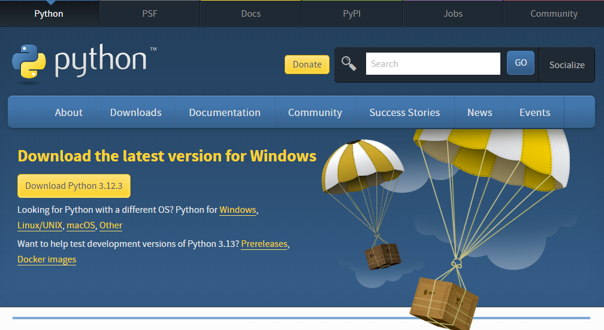

# Pythonの最初のステップ for Windows

- [Pythonの最初のステップ for Windows](#pythonの最初のステップ-for-windows)
  - [Pythonの簡単な説明](#pythonの簡単な説明)
    - [Pythonの特徴](#pythonの特徴)
    - [Pythonの欠点](#pythonの欠点)
  - [Pythonのインストール](#pythonのインストール)
  - [Visual Studio Code(VSCode)のインストール](#visual-studio-codevscodeのインストール)
  - [Python拡張機能のインストール](#python拡張機能のインストール)
  - [VSCodeのエディタ設定](#vscodeのエディタ設定)
  - [インタープリタの使用](#インタープリタの使用)

## Pythonの簡単な説明

### Pythonの特徴

- オープンソース
- コードの記述がシンプルなインタプリタ言語
- Python公式から提供される標準ライブラリが豊富
- Pythonのエコシステムを形成するコミュニティのライブラリの開発が活発
- 機械学習向けの言語として注目
- 動作環境(Pythonランタイム)があれば、Webシステムなど、どのようなプログラムでも記述可能
- 人気のあるプログラミング言語の1つで、人気は`JavaScript`に次いで２位(2024年)

### Pythonの欠点

- プログラムの実行速度が遅い
- 型安全でない
- 実行する前にプログラムに誤りがあることに気付きにくい
- 明示的に型を示さないため、過去に実装したコードの可読性が低い
- プログラムの可搬性が低い
- OS上で動作するランタイム上で実行されるため、OSなど低水準（機械に近い）な処理は記述不可能

```python
# pythonで実装したフィボナッチ数列の例
def fibonacci(n):
    if n == 0:
        return 0
    elif n == 1:
        return 1
    else:
        return fibonacci(n - 1) + fibonacci(n - 2)

# pythonはタイプヒントにより、次のように関数を定義できるが、実行時には無視される。
# def fibonacci(n: int) -> int:
#     pass
#
# `mypy`などの静的型チェッカーを使うことで、実行前に型の不整合を検出できる。
# ただし、正しくタイプヒントで表現することが難しい場合がある。
# 次の場合、型をタイプヒントでどのように表現する???
# d = { "a": 42, "b": "foo", "c": 3.47, "d": [1, ["a", "b", 3], "bar"]}
```

```rust
/// rustで実装したフィボナッチ数列の例
fn fibonacci(n: u32) -> u32 {
    match n {
        0 => 0,
        1 => 1,
        _ => fibonacci(n - 1) + fibonacci(n - 2),
    }
}
```

## Pythonのインストール

[Python公式サイト](https://www.python.org/)の[ダウンロードページ](https://www.python.org/downloads/)にWebブラウザでアクセスして、`Download Python 3.x.x`ボタンをクリックします。



ダウンロードボタンをクリックしたブラウザが動作している環境に適した最新のPythonのインストーラーの保存を求められるため、自分のPCにインストーラーを保存します。

Pythonインストーラーのダウンロードが完了したら、ダウンロードしたインストーラーをダブルクリックして実行します。

Install Python 3.x.xの画面では、`Add python.exe to PATH`にチェックを入れて、`Install Now`ボタンをクリックします。


`Setup was successful`と表示されればPythonのインストールは完了です。同じ画面の`Close`ボタンをクリックしてインストーラーを終了します。

Pythonが正常にダウンロードされているか確認するために、タスクバーの検索ボックス(Windowsアイコンの右の虫眼鏡)をクリックして、`ここに入力して検索`に`cmd`と入力してコマンドプロンプトを起動します。

コマンドプロンプトが起動したら、`python --version`と入力してEnterキーを押します。
インストールしたPythonのバージョンが表示されればPythonのインストールは成功です。

「内部コマンドまたは外部コマンド、操作可能なプログラムまたはバッチファイルとして認識されません。」などのエラーメッセージが表示された場合は、Pythonインタープリタへのパスが環境変数に設定されていない可能性があります。この場合、次をコマンドプロンプトで実行した後、再度`python --version`を実行してください。

> 次はPython3.12の場合です、異なるバージョンをインストールした場合は`Python<version>`の部分を適宜変更してください。

- PowerShellの場合

```powershell
 $ENV:Path+=";C:\Users\d12272\AppData\Local\Programs\Python\Python312\Scripts\"
```

- MS-DOSの場合

```dos
set PATH=%PATH%;C:\Users\d12272\AppData\Local\Programs\Python\Python312\Scripts\
```


## Visual Studio Code(VSCode)のインストール

[VSCode公式サイト](https://azure.microsoft.com/ja-jp/products/visual-studio-code)にWebブラウザでアクセスして、`Visual Studio Codeをダウンロードする`ボタンをクリックします。


表示された`Download Visual Studio Code`ページにある`Windows`ボタンをクリックします。
`Windows`ボタンをクリックすると最新のVSCodeのインストーラーの保存を求められるため、自分のPCにインストーラーを保存します。


VSCodeのインストーラーのダウンロードが終了したら、VSCodeのインストーラーをダブルクリックして実行します。

インストーラーを実行した時、「このインストーラーは管理者としてVSCodeを実行することを意図していない・・・」などの警告が表示されるかもしれませんが、無視して`OK`ボタンをクリックしてください。

VSCodeのインストーラーには、次を入力してください。

- 使用許諾契約書の同意: 同意する
- インストール先の指定: デフォルト
- スタートメニューディレクトリーの指定: デフォルト
- 追加タスクの選択
  - アイコンを追加する:
    - デスクトップ上にアイコンを作成する: 任意
  - その他:
    - エクスプローラーのファイルコンテキストメニューに[Codeで開く]アクションを追加する: チェック推奨
    - エクスプローラーのディレクトリコンテキストメニューに[Codeで開く]アクションを追加する: チェック推奨
    - サポートされているファイルの種類のエディターとして、Codeを登録する: チェック推奨
  - PATHへの追加(再起動後に使用可能): **チェック**
- インストール準備完了
  - `インストール`ボタンをクリック

VSCodeのインストール完了画面が表示されたら`完了`ボタンをクリックして、VSCodeのインストーラーを終了します。

VSCodeが起動したらVSCodeのインストールは成功です。

タスクバーの検索ボックスに`code`と入力してVSCodeを起動できることを確認してください。
またインストーラーの画面で`エクスプローラーの〇〇コンテキストメニューに・・・`をチェックした場合は、エクスプローラーでファイルまたはディレクトリをマウスで右クリックして表示されるコンテキストメニューに`Codeで開く`メニューがあること、そのメニューをクリックしたときVSCodeが起動することを確認してください。


## Python拡張機能のインストール

VSCodeの画面の左にある`Extensions`をクリックして次の拡張機能をインストールします。

- `Python`: Microsoft社
- `Japanese Language Pack for Visual Studio Code`: Microsoft社
- `indent-rainbow`: oderwat社

上記拡張機能は、`Extensions`の上部にある`Search Extensions in Marketplace`に`python`や`japanese`を入力することで検索できます。
それぞれの拡張機能が見つかったら、その拡張機能の右下にある小さな`Install`をクリックすることで拡張機能をインストールできます。

Python拡張機能をインストールすると`Pylance`と`Python Debugger`も同時にインストールされます。
これらの拡張機能が、Pythonコードを自動補間や整形したり、デバッグを支援するなど、開発者の実装体験(エクスペリエンス)を向上します。
<<<<<<< HEAD

Pythonコードは、条件判断した結果によって実行するコードの範囲や、繰り返し処理するコードの範囲をインデント(字下げ)で表現します。
`indent-rainbow`拡張機能は、Pythonコードのインデントを視覚的にわかりやすく表示するための拡張機能です。
また、上記で説明したコードの範囲をインデントで表現することを、Pythonではブロックと呼びます。


## VSCodeのエディタ設定

Pythonでコードを記述する場合、次のようなコーディングスタイルがあり[PEP8](https://peps.python.org/pep-0008/)として公開されています。

- 文字エンコーディングはUTF-8
- インデントはスペース4つ

また、改行コードの標準は、Windowsでは`CRLF`、LinuxやMacでは`LF`です。
PEP8に定められてはいませんが、`LF`が望ましいのではないかと考えています。

> 共同開発する場合は、コーディングスタイルを統一することが重要です。

上記コーディングスタイルを苦痛なく実現するために、VSCodeの設定を次の通り変更します。

1. VSCodeで`Ctrl+Shift+P`を押して、コマンドパレットを表示します。
2. コマンドパレットに`open user settings`と入力していくと、コマンドの候補がリストされるため`Preferences: Open User Settings`をマウスで選択します。
3. テキスト入力欄に`editor: tab size`と入力して、表示された`Editor: Tab Size`の値を`4`に変更します。
4. 同様に`editor: insert spaces`と入力して、表示された`Editor: Insert Spaces`をチェックします。
5. 次に`files: eol`と入力して、表示された`Files: Eol`に`\n`を入力します。
6. 最後に`files: encoding`と入力して、表示された`Files: Encoding`に`UTF-8`を入力します。

VSCodeの設定は即座に反映されるため、`OK`ボタンをクリックするなどのアクションは必要ありません。

- `Preferences: Open User Settings`


- `Editor: Tab Size`


- `Editor: Insert Spaces`


- `Files: Eol`


- `Files: Encoding`


## インタープリタの使用

インタープリタを使用するためには、ターミナルを起動する必要があります(もしかしたら、すでに起動しているかもしれません)。
VSCodeの[Terminal]メニューから[New Terminal]を選択すると、VSCodeの下部にターミナルが表示されます(Ctrl+Shift+@)。

- PowerShell


- コマンドプロンプト(MS-DOS)


ターミナルに`python`と入力して`Enter`キーを押します。
Pythonのインタープリタが起動し、`>>>`(プロンプト)が表示されれば、Pythonのインタープリタを使用できます。

- PowerShellの場合

```
PS C:\Users\xxx> python
Python 3.12.3 (tags/v3.12.3:f6650f9, Apr  9 2024, 14:05:25) [MSC v.1938 64 bit (AMD64)] on win32
Type "help", "copyright", "credits" or "license" for more information.
>>>
```

- MS-DOSの場合

```
C:\Users\xxx> python
Python 3.12.3 (tags/v3.12.3:f6650f9, Apr  9 2024, 14:05:25) [MSC v.1938 64 bit (AMD64)] on win32
Type "help", "copyright", "credits" or "license" for more information.
>>>
```

インタープリタに次を1行ずつ入力して、`Enter`キーを押して、どのように機能するか確認してください。

```python
print("Hello, Python!")
1 + 2
3 * 6
12 / 4
type(12 / 4)
12 // 4
type(12 // 4)
13 / 4
13 // 4
13 % 4
4**2
10 + 10.5
"hello, " + "world!"
type(43)
type("43")
a = 43
print(f"a = {a}")
import math
pi = math.pi
pi
math.sin(pi)
math.sin(math.pi)
def fibonacci(n):
    if n == 0:
        return 0
    elif n == 1:
        return 1
    else:
        return fibonacci(n - 1) + fibonacci(n - 2)

fibonacci(10)
exit()
```

`def fibonacci(n):`と入力して`Enter`キーを押すと、次の行が`...`に変わります。
関数のブロックを表現する必要があるため、`Tab`キーを押した後`if n == 0:`と入力して`Enter`キーを押します。
それぞれの`return`文を入力する前に`Taq`キーを2回押す必要があります。
`fibonacci`関数の最後の`return`文の後は、`Enter`キーを2回押すと`...`が消えて、次の行が`>>>`に変わります。

> `...`が表示されている場合、ブロック内のコードを入力する必要があることを示しています。

インタープリタに`exit()`と入力して`Enter`キーを押すと、Pythonのインタープリタが終了します(`Ctrl+d`でも終了できます)。

## チュートリアル用のプロジェクトの作成

1. エクスプローラーを開き、例えば`C:\Users\<user-identifier>\Documents`ディレクトリ(フォルダ、`PC > ドキュメント`と表示されています)に`py_tutorial`ディレクトリを作成します。
2. 作成した`py_tutorial`ディレクトリを右クリックして、表示されたコンテキストメニューから`Codeで開く`を選択して、`py_tutorial`をカレントディレクトリとしてVSCodeが起動します。

`Do you trust the authors of the files in this folder?`と表示された場合、**全面的に信用**するため、`Truest the authors of all file in the parent folder 'Documents'`をチェックして、`Yes, I trust the authors`ボタンをクリックしてください。

以降`py_tutorial`ディレクトリを**プロジェクトディレクトリ**と呼びます。
また、ファイルやディレクトリのパスは、カレントディレクトリからの相対パスで表現します。

```text
py_tutorial
├─cart
│  └─templates
├─coupons
│  └─migrations
└─locale
    └─es
        └─LC_MESSAGES
        └─payment
```

`cart`のパスは、`cart`または`.\cart`と表現します。
`LC_MESSAGES`のパスは、`locale\es\LC_MESSAGES`または`.\locale\es\LC_MESSAGES`と表現します。
最初の`.`は現在のディレクトリを示しており、つまり`py_tutorial`ディレクトリです。
ただし、`cart`ディレクトリを`py_tutorial\cart`と表現できません。これは存在しない`py_tutorial\py_tutorial\cart`を示します。

## 仮想環境の作成

PythonはOSにインストールされています。
今後のプロジェクトでは、多種多彩なプログラムを実装することになります。
しかし、将来を含むそれぞれのプロジェクトは、現在インストールされているPythonのバージョンで動作しないでしょう。

また、それぞれのプロジェクトでは、色々なパッケージを導入して、プログラムの機能や開発速度を向上させます。
ここで、パッケージ間のバージョン依存により、新しい機能が追加された最新バージョンのパッケージを利用する必要があったとします。
しかし、あるプロジェクトが想定しているパッケージのバージョンと最新バージョンに互換性がない場合、最新バージョンを導入をあきらめなければならないかもしれません。

> セマンティックバージョニングを採用している場合の、メジャーバージョンの増加(1.0.0 -> 2.0.0)は、後方互換性を維持していません。

このため、Pythonのプログラムを実装する場合、そのプロジェクトのPythonバージョンやパッケージのバージョンが、OSにインストールされたPythonに影響を与えないように、別の環境を用意してプロジェクト用に環境を固定することが基本です。
この別の環境のことを**Python仮想環境**または単に**仮想環境**と呼んでいます。

プロジェクト用の仮想環境を作成して、作成した仮想環境を次の通り有効にします。
1行目は、プロジェクトディレクトリ（カレントディレクトリ）に`.venv`ディレクトリを作成して、そのディレクトリに仮想環境を作成するコマンドです。
2行目は、作成した仮想環境を有効にするコマンドです。

- PowerShellの場合
```powershell
python -m venv .venv
.\.venv\Scripts\Activate.ps1
```

- MS-DOSの場合

```dos
python -m venv .venv
.venv\Scripts\activate.bat 
```

## VSCodeで仮想環境を選択

Python拡張機能がプロジェクト用の仮想環境を認識できるように、次の通りVSCodeを設定します。

1. `Ctrl+Shit+P`を押してコマンドパレットを表示します。
2. 表示さえたコマンドパレットで`python: select interpreter`と入力して、表示されたリストから`Python: Select Interpreter`を選択します。
3. 表示された仮想環境（OSにインストールされたPythonを含む）がリストされるため、表示された候補のパスを確認して`Python x.x.x ('.venv': venv) .\venv\Scripts\python.exe - Recommended`を選択します。

「Pythonの仮想環境の有効化に成功しけど、ターミナルのプロンプトのインジケーターに"(.venv)"と表示されてないかもしれないよ」的なメッセージが表示されるかもしれません。
その場合、単にそのメッセージを閉じるか、`Don't show again`をクリックしてください。
`Don't show again`ボタンの下に`Python 3.12.3 ('.venv': venv)`と表示されていれば、仮想環境が有効になっています。

