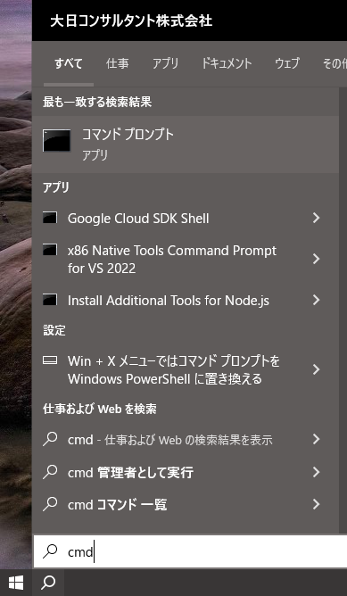
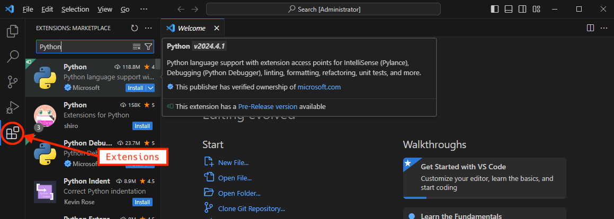
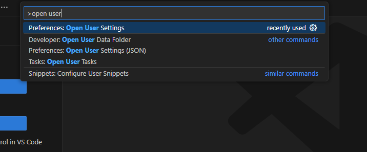
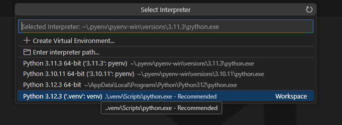

# Python概要 for Windows（簡易版）

- [Python概要 for Windows（簡易版）](#python概要-for-windows簡易版)
  - [はじめに](#はじめに)
  - [Pythonの簡単な説明](#pythonの簡単な説明)
    - [Pythonの特徴](#pythonの特徴)
    - [Pythonの欠点](#pythonの欠点)
      - [プログラムの実行速度が遅い](#プログラムの実行速度が遅い)
  - [Pythonのインストール](#pythonのインストール)
  - [Visual Studio Code(VSCode)のインストール](#visual-studio-codevscodeのインストール)
  - [VSCodeセキュリティポリシーのの変更](#vscodeセキュリティポリシーのの変更)
  - [Python拡張機能のインストール](#python拡張機能のインストール)
  - [VSCodeのエディタ設定](#vscodeのエディタ設定)
  - [インタープリタの使用](#インタープリタの使用)
  - [チュートリアル用のプロジェクトの作成](#チュートリアル用のプロジェクトの作成)
  - [仮想環境の作成と有効化](#仮想環境の作成と有効化)
  - [VSCodeで仮想環境を選択](#vscodeで仮想環境を選択)
  - [言語機能の説明](#言語機能の説明)
    - [コメント](#コメント)
    - [プリミティブ（基本的）なデータ型](#プリミティブ基本的なデータ型)
      - [str型（文字列）](#str型文字列)
      - [int型（整数）](#int型整数)
      - [float型（64bit浮動小数点数）](#float型64bit浮動小数点数)
      - [bool型（真偽値）](#bool型真偽値)
      - [None（のん）](#noneのん)
    - [コレクション型](#コレクション型)
      - [list型（リスト）](#list型リスト)
      - [dict型（辞書）](#dict型辞書)
    - [変数](#変数)
    - [論理式](#論理式)
      - [論理演算](#論理演算)
      - [偽（False）と判定されるもの](#偽falseと判定されるもの)
    - [関数](#関数)
      - [代表的な引数の種類](#代表的な引数の種類)
        - [位置引数](#位置引数)
        - [名前付き引数](#名前付き引数)
    - [スコープ](#スコープ)
    - [プログラムの制御構造](#プログラムの制御構造)
      - [順次](#順次)
      - [分岐](#分岐)
        - [閏年の判定](#閏年の判定)
      - [繰り返し](#繰り返し)
  - [外部パッケージの利用](#外部パッケージの利用)
  - [最後に](#最後に)

## はじめに

現在日本では、ICTとデータを利活用してビジネス上の改題を解決する「DX（デジタルトランスフォーメーション）」、
柔軟な働き方がしやすい環境を整備する「働き方改革」などが始まっています。

これらとは少し関連して、少し異なる観点からプログラミングを学ぶ重要性をお話しします。

皆さんの多くは、社会基盤工学を習得して、顧客から信頼されるエンジニアになることが求められています。
しかし、入社して数年は、社会基盤工学を習得する傍ら、社会基盤工学と直接関連しない資料整理やデータ整理などの作業を求められることがあるかもしれません。

これらの作業は、業務上絶対にやらなければならないものですが、エンジニアとなる皆さんにそのような作業を担わせることは、会社にとってあまり有益ではありません。
先に説明した通り、会社としては、皆さんがエンジニアとなる方がはるかに有益だからです。

このギャップを解消または緩和するためには、そのような作業のパターン（繰り返し）を見つけて自動化することが必要です。
そして、自動化によって得られた時間を、エンジニアとして担う業務または技術の取得に費やすべきです。

これから説明するPythonは、比較的習得しやすく、多くのライブラリが提供されているため、そのような作業の自動化に適しています。
研修だけでPythonを習得することは難しいですが、自動化が必要になったとき、Pythonはその手段の候補の1つになると考えられます。

さらに、現在では、システムエンジニアでなくても、`Google Apps Script(GAS)`を利用することで、なんらかのサービスを容易に構築できるなど環境が整いつつあります。
ある取り組みでは、Googleフォームで注文を受け取り、自動で注文受付メールをお客様に送信、従業員に注文をLINEで通知、スプレッドシートで注文を整理するなどの取り組みをしています。
近い将来、システムエンジニアでなくても、顧客にサービスを提供することができるようになるかもしれません。

> ただし、セキュリティの確保、プライバシーの保護、外部からの攻撃を回避または防止するなどの対策が必要です。

## Pythonの簡単な説明

### Pythonの特徴

- オープンソース
- コードの記述方法がシンプル
- プログラムの実行時にコードを機械語に変換するインタープリタ言語であるため手軽に実行できる
- Python公式から提供される標準ライブラリが豊富
- 標準ライブラリ以外にも、コミュニティによる多種多様なライブラリ（パッケージ）の開発が活発
- 世界中で人気のあるプログラミング言語の1つで、人気は`JavaScript`に次いで2位(2024年)

### Pythonの欠点

- プログラムの実行速度が遅い
- 型安全でない、実行する前にプログラムに誤りがあることに気付きにくい
- 明示的に型を示さないため、過去に実装したコードの可読性が低い
- 大規模なプログラムの場合、ソースコードをすべて渡す必要があるなど、可搬性が低い
- OS上で動作するランタイム上で実行されるため、OSなど低水準（機械に近い）な処理は記述不可能

> OS: Operating System、基本ソフトウェア、WindowsやLinuxやmacOSなど

#### プログラムの実行速度が遅い

Pythonはインタープリタ言語であるため、実行時にソースコードを機械語に変換するコストがかかり、コンパイラ言語よりも実行速度が遅くなります。

フィボナッチ数は次のとおり一般化され、その数列は`0, 1, 1, 2, 3, 5, 8, 13, 21, 34, 55, 89, 144, ...`です。

```text
fibonacci(0) = 1 (n = 0)
fibonacci(1) = 1 (n = 1)
fibonacci(n) = fibonacci(n - 1) + fibonacci(n - 2) (n >= 2)
```

PythonとRustで項45のフィボナッチ数は、`1,134,903,170`で、計算したときの処理時間は次のとおりです。

| 言語   | 実行時間(secs) | 備考                   |
| ------ | -------------: | ---------------------- |
| Python |        129.849 | Rustよりも40倍以上遅い |
| Rust   |          3.644 | -                      |

ただし、**Pythonには、実行速度に遅さを補うほど、手軽に利用できる大きな利点があります**。

実験で試したコードは次の通りです。

- Pythonのコード

```python
import sys
import time


def fibonacci(n):
    if n == 0:
        return 0
    elif n == 1:
        return 1
    return fibonacci(n - 2) + fibonacci(n - 1)


if __name__ == "__main__":
    args = sys.argv
    if len(args) != 2:
        print("expected one argument", file=sys.stderr)
        sys.exit(1)
    try:
        n = int(args[1])
    except ValueError:
        print("expected an integer number", file=sys.stderr)
        sys.exit(1)

    # フィボナッチ数を求める
    started = time.time()
    value = fibonacci(n)
    finished = time.time()
    elapsed = finished - started
    print(f"fibonacci value: {value} ({elapsed:.3f} seconds)")
```

- Rustのコード

```rust
use anyhow::{anyhow, bail};

fn main() -> anyhow::Result<()> {
    let mut args = std::env::args();
    if args.len() != 2 {
        bail!("expected one argument")
    }
    let _ = args.next();
    let n = args
        .next()
        .unwrap()
        .parse::<u32>()
        .map_err(|e| anyhow!(e))?;

    // フィボナッチ数を求める
    let started = std::time::SystemTime::now();
    let value = fibonacci(n);
    let elapsed = started.elapsed().unwrap();
    let elapsed = elapsed.as_secs_f32();
    println!("fibonacci value: {value} ({elapsed:.3} seconds)");

    Ok(())
}

fn fibonacci(n: u32) -> u32 {
    match n {
        0 => 0,
        1 => 1,
        _ => fibonacci(n - 2) + fibonacci(n - 1),
    }
}
```

## Pythonのインストール

[Python公式サイト](https://www.python.org/)の[ダウンロードページ](https://www.python.org/downloads/)にWebブラウザでアクセスして、`Download Python 3.x.x`ボタンをクリックします。


最新のPythonのインストーラーを保存することを求められるため、自分のPCにインストーラーを保存します。

Pythonインストーラーのダウンロード完了後、ダウンロードしたインストーラーをダブルクリックして実行します。

`Install Python 3.x.x`画面では、`Add python.exe to PATH`にチェックを入れて、`Install Now`ボタンをクリックします。

> 私の場合、実際には環境変数`PATH`にPythonインタープリタのパスが追加されませんでした。


`Setup was successful`と表示されればPythonのインストールは完了です。
同じ画面の`Close`ボタンをクリックしてインストーラーを終了します。

Pythonが正常にダウンロードされているか確認するために、タスクバーの検索ボックス(Windowsアイコンの右の虫眼鏡)をクリックして、`ここに入力して検索`に`cmd`と入力してコマンドプロンプトを起動します。



コマンドプロンプトの起動後、`python --version`と入力してEnterキーを押します。
インストールしたPythonのバージョンが表示されていれば、Pythonのインストールは成功です。


「内部コマンドまたは外部コマンド、操作可能なプログラムまたはバッチファイルとして認識されません。」などのエラーメッセージが表示された場合は、Pythonインタープリタへのパスが環境変数に設定されていない可能性があります。この場合、次をコマンドプロンプトで実行した後、再度、コマンドプロンプトで`python --version`を実行してください。

> 次はPython3.12の場合です、異なるバージョンをインストールした場合は`Python312`の部分を適宜変更してください。
>
> また、`<user-name>`の部分は、上記画像の`C:\Users\<user-name> >`の`<user-name>`に置き換えてください（ぼかしてある部分です）。

- PowerShellの場合

```ps
 $ENV:Path+=";C:\Users\<user-name>\AppData\Local\Programs\Python\Python312\Scripts\"
```

- MS-DOSの場合

```dos
set PATH=%PATH%;C:\Users\<user-name>\AppData\Local\Programs\Python\Python312\Scripts\
```

> 環境変数`PATH`は`OS`が使用する重要な設定の1つです。
> `PATH`は、`OS`がプログラムやコマンドを実行する際に、そのプログラムがどこにあるかを示すリストです。
> このリストには、ディレクトリ（フォルダー）のパスが含まれており、`OS`がそのリストからもt句的のファイルをなどを見つけることができます。
> `PATH`に設定されている値を表示するには、コマンドプロンプトで`echo %PATH%`を実行してください。

## Visual Studio Code(VSCode)のインストール

本チュートリアルでは、Pythonコードの記述を`Visual Studio Code`（以下、VSCode）で行います。

[VSCode公式サイト](https://azure.microsoft.com/ja-jp/products/visual-studio-code)にWebブラウザでアクセスして、`Visual Studio Codeをダウンロードする`ボタンをクリックします。


表示された`Download Visual Studio Code`ページにある`Windows`ボタンをクリックします。
`Windows`ボタンをクリックすると最新のVSCodeのインストーラーの保存を求められるため、自分のPCにインストーラーを保存します。


VSCodeのインストーラーのダウンロード完了後、VSCodeのインストーラーをダブルクリックして実行します。

インストーラーを実行したとき、「このインストーラーは管理者としてVSCodeを実行することを意図していない・・・」などの警告が表示された場合、警告を無視して`OK`ボタンをクリックしてください。

VSCodeのインストーラー画面では、次を入力してください。

- 使用許諾契約書の同意: 同意する
- インストール先の指定: デフォルト
- スタートメニューディレクトリの指定: デフォルト
- 追加タスクの選択
  - アイコンを追加する:
    - デスクトップ上にアイコンを作成する: 任意
  - その他:
    - エクスプローラーのファイルコンテキストメニューに[Codeで開く]アクションを追加する: **チェック**
    - エクスプローラーのディレクトリコンテキストメニューに[Codeで開く]アクションを追加する: **チェック**
    - サポートされているファイルの種類のエディターとして、Codeを登録する: チェック推奨
  - PATHへの追加(再起動後に使用可能): **チェック**
- インストール準備完了
  - `インストール`ボタンをクリック

VSCodeのインストール完了画面が表示された後、同じ画面の`完了`ボタンをクリックして、VSCodeのインストーラーを終了します。

インストーラーの終了後、VSCodeが起動すれば、VSCodeのインストールは成功です。

タスクバーの検索ボックスに`code`と入力してVSCodeが起動できることを確認してください。

また、エクスプローラーでファイルまたはディレクトリをマウスで右クリックして表示されるコンテキストメニューに`Codeで開く`メニューがあること、そのメニューをクリックしたときVSCodeが起動することを確認してください。


## VSCodeセキュリティポリシーのの変更

VSCodeのセキュリティポリシーを変更して、後で説明する仮想環境を有効にするコマンドを実行できるようにします。

- `Ctrl + Shift + P`を押して、コマンドパレットを表示します。
- `open user settings`と入力して、表示された`Preferences: Open User Settings (JSON)`を選択します。
- VSCodeの画面に表示された`settings.json`に編集して次に表示される状態にします。

```json
{
  "terminal.integrated.env.windows": {
    "PSExecutionPolicyPreference": "RemoteSigned"
  }
}
```

- `Ctrl + S`を押して、`settings.json`を保存します。
- VSCodeで開いている`settings.json`を閉じます。


## Python拡張機能のインストール

VSCodeで快適にPythonコードを記述するために、VSCodeの画面の左にある`Extensions`をクリックして次の拡張機能をインストールします。

- `Python`: Microsoft社
- `Japanese Language Pack for Visual Studio Code`: Microsoft社
- `indent-rainbow`: oderwat社

上記拡張機能は、`Extensions`の上部にある`Search Extensions in Marketplace`に`python`や`japanese`を入力することで検索できます。
それぞれの拡張機能が見つけた後、その拡張機能の右下にある小さな`Install`をクリックしてそれぞれの拡張機能をインストールしてください。

> 警告: 似たような名前の拡張機能があるため、`Install`をクリックする拡張機能を十分に確認してください。




Python拡張機能をインストールすると`Pylance`と`Python Debugger`も同時にインストールされます。
これらの拡張機能が、Pythonコードを自動で補間や整形したり、デバッグを支援するなど、開発者の実装体験を向上させます。

また、Pythonコードは、条件判断した結果によって実行するコードの範囲や、繰り返し処理するコードの範囲をインデント(字下げ)で表現します。
`indent-rainbow`は、Pythonコードのインデントを視覚的にわかりやすく表示する拡張機能です。
なお、上記で説明したインデントした範囲を**ブロック**と呼びます。


## VSCodeのエディタ設定

Pythonでコードを記述する場合、次のようなコーディングスタイルがあり[PEP8](https://peps.python.org/pep-0008/)として公開されています。

- インデントはスペース4つ
- 文字エンコーディングはUTF-8

なお、改行コードは、Windowsにおいて`CRLF(0x0D0A)`、LinuxやMacでは`LF(0x0A)`が標準です。
`PEP8`に定められてはいませんが、本チュートリアルでは改行コードを`LF`に統一します。

> 共同開発する場合は、コーディングスタイルを統一することが重要です。

上記コーディングスタイルを自然に遵守できるように、VSCodeを次のとおり設定します。

1. VSCodeで`Ctrl + Shift + P`を押して、コマンドパレットを表示します。
2. コマンドパレットに`open user settings`と入力していくと、コマンドの候補がリストされるため`Preferences: Open User Settings`をマウスで選択します。
3. `Settings`タブの上部にあるテキスト入力欄に`editor: tab size`と入力して、表示された`Editor: Tab Size`の値を`4`に変更します。
4. 同様に`editor: insert spaces`と入力して、表示された`Editor: Insert Spaces`をチェックします。
5. 次に`files: encoding`と入力して、表示された`Files: Encoding`に`UTF-8`を入力します。
6. 最後に`files: eol`と入力して、表示された`Files: Eol`に`\n`を入力します。

`Editor: Insert Spaces`をチェックすると、`Tab`キーを押したときにスペースが挿入されます。
挿入されるスペースの数は、`Editor: Tab Size`で設定した値になります。
また、`eol`は`end of line(s)`の略です。

VSCodeの設定は即座に反映されるため、`OK`ボタンをクリックするなどのアクションは必要ありません。

- `Preferences: Open User Settings`



- `Editor: Tab Size`


- `Editor: Insert Spaces`


- `Files: Encoding`


- `Files: Eol`


## インタープリタの使用

Pythonのインタープリタは、ターミナルから使用します(すでにターミナルが起動しているかもしれません)。
VSCodeの[Terminal]メニューから[New Terminal]を選択すると、VSCodeの下部にターミナルが表示されます(`Ctrl + Shift + @`)。


ターミナルに`python`と入力して`Enter`キーを押して、インタープリタを起動ます。
`>>>`(プロンプト)が表示されれば、インタープリタが起動しています。

```ps
PS C:\Users\xxx> python
Python 3.12.3 (tags/v3.12.3:f6650f9, Apr  9 2024, 14:05:25) [MSC v.1938 64 bit (AMD64)] on win32
Type "help", "copyright", "credits" or "license" for more information.
>>>
```

インタープリタに次を1行ずつ入力して、`Enter`キーを押してください。
入力した結果、インタープリタがどのように応答するか確認してください。

> `#`から右は入力する必要はありません。

```python
print("Hello, Python!")
1 + 2       # 加算
1 - 2       # 減算
3 * 6       # 乗算
2 ** 3      # 累乗（2の3乗）
13 / 4      # 除算（結果はfloat（浮動小数点数型））
13 // 4     # 整数除算（結果はint（整数型））
13 % 4      # 剰余演算（13 ÷ 4 = 3 余り 1なので、あまりの1が結果）
"hello, " + "world!"    # 文字の連結
for n in range(10):     # 繰り返し処理
    print(n)

import math # mathモジュールをインポート
math.pi     # 円周率
math.sin(math.pi)   # sign(π)を計算
exit()      # インタープリタを終了
```

`range`関数は、指定した数値までの整数を*生み出し*ます。

`for n in range(10):`の行を入力した後、`Enter`キーを押すと、次の行が`...`に変わります。
`for`文が実行するブロックを表現する必要があるため、`Tab`キーを押した後`print(n)`と入力して`Enter`キーを2回押します。

> `...`が表示されている場合、ブロック内のコードを入力する必要があることを示しています。

インタープリタに`exit()`と入力して`Enter`キーを押すと、Pythonのインタープリタが終了します(`Ctrl + D`でも終了できます)。

## チュートリアル用のプロジェクトの作成

1. エクスプローラーを開き、例えば`C:\Users\<user-name>\Documents`ディレクトリ(フォルダ、エクスプローラーでは`PC > ドキュメント`と表示されます)に`py_tutorial`ディレクトリを作成します。
2. 作成した`py_tutorial`ディレクトリを右クリックして、表示されたコンテキストメニューから`Codeで開く`を選択すると、`py_tutorial`をカレントディレクトリとして開いた状態でVSCodeが起動します。

`Do you trust the authors of the files in this folder?`と表示された場合、**とりあえず信用する**ため、`Truest the authors of all file in the parent folder 'Documents'`をチェックして、`Yes, I trust the authors`ボタンをクリックしてください。

> これは、[CVE-2020-1416](https://cve.mitre.org/cgi-bin/cvename.cgi?name=CVE-2020-1416)に対するセキュリティ対策です。
> VSCode(とVisual Studio)は、ソフトウェアの依存関係を読み込むときに権限が昇格する脆弱性があり、悪意のあるプログラムが特権を取得することで、被害を受ける可能性があります。

以降`py_tutorial`ディレクトリを**プロジェクトディレクトリ**と呼びます。
また、ファイルやディレクトリのパスは、カレントディレクトリからの相対パスで表現します。

```text
py_tutorial
├─cart
│  └─templates
├─coupons
│  └─migrations
└─locale
    └─es
        └─LC_MESSAGES
        └─payment
```

`cart`のパスは、`cart`または`.\cart`と表現します。
`LC_MESSAGES`のパスは、`locale\es\LC_MESSAGES`または`.\locale\es\LC_MESSAGES`と表現します。
パスの最初の文字の`.`は現在のディレクトリを示しており、つまり`py_tutorial`ディレクトリです。
ただし、`cart`ディレクトリを`py_tutorial\cart`と表現できません。これは存在しない`py_tutorial\py_tutorial\cart`を示します。

## 仮想環境の作成と有効化

先ほどインストールしたPythonは、`OS`に直接インストールされています。

今後、多くのプロジェクトでプログラムを実装することになるかもしれません。
それぞれのプロジェクトでは、様々なパッケージを導入して、プログラムの開発速度や機能を向上させます。

ここで、新しい機能が追加された最新バージョンのパッケージを利用したいと考えたとします。
しかし、他のプロジェクトが導入した同じパッケージのバージョンと、最新バージョンに互換性がない場合、最新バージョンを導入したとき、他のプロジェクトが動作しなくなる可能性があります。

> セマンティックバージョニングを採用している場合、バージョン番号のメジャーバージョンの増加(1.0.0 -> 2.0.0)は、後方互換性を維持していません。
> セマンティックバージョニングにおけるバージョン番号は、`major.minor.patch`の3つの数字で構成されています。
> マイナーバージョンの増加は、後方互換性を維持した機能追加です。
> パッチバージョンの増加は、後方互換性を維持したバグ修正です。

このため、Pythonのプログラムを実装する場合、そのプロジェクトで導入するパッケージのバージョンが、OSに直接インストールされたPythonや他のプロジェクトで使用しているPythonに影響を与えないように、**別の環境**を用意することが普通です。
この別の環境のことを**Python仮想環境**または単に**仮想環境**と呼びます。

本チュートリアル用の仮想環境を作成して、作成した仮想環境を次の通り有効にします。
1行目は、プロジェクトディレクトリ（カレントディレクトリ）に`.venv`ディレクトリを作成して、`.venv`ディレクトリに仮想環境を作成する`venv`コマンドです。
2行目は、作成した仮想環境を有効にするコマンドです。

> ファイルやディレクトリの名前の最初に`.`が付いている場合、それらは隠しファイルや隠しディレクトリです。

コマンドの実行後、ターミナルのプロンプトに`(.venv)`が表示されていれば、仮想環境が有効になっています。

```ps
python -m venv .venv
.\.venv\Scripts\Activate.ps1
```

## VSCodeで仮想環境を選択

Python拡張機能が本チュートリアル用の仮想環境を認識できるように、次の通りVSCodeを設定します。

1. `Ctrl + Shit + P`を押してコマンドパレットを表示します。
2. 表示されたコマンドパレットで`python: select interpreter`と入力して、表示されたリストから`Python: Select Interpreter`を選択します。
3. 選択可能な仮想環境（OSにインストールされたPythonを含む）がリストされるため、表示された候補のパスを確認して`Python x.x.x ('.venv': venv) .\venv\Scripts\python.exe - Recommended`を選択します。



「Pythonの仮想環境の有効化に成功したけど、ターミナルのプロンプトのインジケーターに"(.venv)"と表示されないかもしれないよ」的なメッセージが表示されるかもしれません。
その場合、単にそのメッセージを閉じるか、`Don't show again`をクリックしてください。
`Don't show again`ボタンの下に`Python x.x.x ('.venv': venv)`と表示されていれば、仮想環境が有効になっています。


## 言語機能の説明

### コメント

VSCodeのエクスプローラーにある`New File`ボタンをクリックして、新しく作成するファイルの名前に`comments.py`と入力します。
次に示すように`comments.py`ファイルが配置されていない場合、プロジェクトディレクトリ直下に`comments.py`ファイルが作成されていない可能性があります。


`comments.py`ファイルに次を入力して、ファイルを保存してください。

```python
# これはコメントです。

print("Hello, Python!")  # `#`から右はコメントです。

"""
ダブルクォート3つで上下を挟んだ場合、ダブルクォートを含めてすべてコメントです。
このコメントの記述は、複数行のコメントを記述できます。
"""

'''
シングルクォート3つで上下を挟んだ場合、効果はダブルクォート3つと同じです。
'''
```

ターミナルで次を実行すると、ターミナル（標準出力）に`Hello, Python!`が表示されます。
コメント部分はプログラムの実行に影響を与えず、インタープリタがコメントとして認識していることがわかります。


### プリミティブ（基本的）なデータ型

Pythonで扱えるプリミティブなデータ型の一部を次に示します。

- `str`: 文字列
- `int`: 整数
- `float`: 浮動小数点数
- `bool`: 真偽値
- `None`: 値がない、または参照するデータがない

#### str型（文字列）

文字列を扱う型です。
表現したい文字列をダブルクォート(`"`)またはシングルクォート(`'`)で挟んで表現します。
文字列を分割、文字列を検索するなど文字列を操作する便利な機能（メソッド）が多く提供されています。

> メソッドは`obj.method(...)`の形式で呼び出します。

```python
>>> "Hello, Python!"  # 文字列はダブルkクォートで囲む
'Hello, Python!'
>>> 'Hello, Python!'  # シングルクォートで囲っても良い
'Hello, Python!'
>>> "Hello, " + "Python!"   # 文字列を`+`演算子で連結
'Hello, Python!'
>>> for ch in "hello":
...     print(ch)
...
h
e
l
l
o
>>> "foo, bar, baz, qux, quux".split(",")   # `split`メソッドを使用して`,`で文字列を分割
['foo', ' bar', ' baz', ' qux', ' quux']
```

#### int型（整数）

整数を表現する型です。
他のプログラミング言語と異なり、メモリを割り当てることが可能な限り、大きな正負の整数を表現できます。

> `8 ÷ 2(2 + 2)`の計算は、Pythonでは`8 // 2 * (2 + 2)`と表現され、その結果は`16`です。
> Pythonは、括弧を優先して左から順に評価することがわかります。
> なお、`//`演算子は、整数の除算を行い、商を整数で返します。
> また、`/`演算子は、整数同士の計算でも、結果を次で説明するfloatで返します。

```python
>>> 8 // 2 * (2 + 2)
16
>>> 8 / 2 * (2 + 2)
16.0
```

#### float型（64bit浮動小数点数）

小数を含む数値を扱う型です。
緯度／経度などの座標値を扱うときなどに使用されます。
浮動小数点数は、符号、仮数部、指数部で表現されるため、有理数の中で正確に表現できない値がある、つまり誤差があります。
2の乗数で表現できる数値の倍数は正確に表現できます。

```text
64bit浮動小数点数の値(IEEE754) = 符号 * 2^(指数部 - 1023) * 1.仮数部
                                   ^^^^^^^^^^^^^^^^  ^^^^^^^^
                                   2の乗数             倍数
0.5 = 1 *   2^(1022 - 1023) * 1.0
      ^       ^^^^^^^^^^^^^     ^
      符号     指数部             仮数部
```

```python
>>> 0.1 + 0.1 + 0.1 == 0.3  # 2の乗数の倍数で表現できない値の演算
0.30000000000000004
>>> 0.5 + 0.5 + 0.5         # 2の乗数の倍数で表現できる値の演算
1.5
```

floatは誤差があるため、**絶対にお金を扱わない**ようにしてください。
お金を扱う場合は、`decimal.Decimal`型を使用してください。
また、計算途中の誤差をなくしたい場合は、有理数を扱う`fractions.Fraction`型を利用できます。

```python
>>> from fractions import Fraction
>>> f = Fraction(1, 10) + Fraction(1, 10) + Fraction(1, 10)
>>> f
Fraction(3, 10)
>>> float(f)
0.3
```

#### bool型（真偽値）

`True`または`False`で真偽値を表現する型です。

```python
>>> True
True
>>> False
False
```

#### None（のん）

値または参照するデータがないことを示すデータ型です。

`None`を扱う場合は、後で説明する**変数**にデータが格納されているか、それとも`None`なのか、常に意識してプログラムを作成する必要があります。

### コレクション型

複数のデータをひとまとめに扱えるデータ型を**コレクション型**と呼びます。
Pythonで扱えるコレクション型の一部を次に示します。

- `list`: リスト
- `dict`: 辞書

#### list型（リスト）

複数のデータを順序付けで格納するコレクション型で、プログラムで頻繁に使用されます。
listには、異なるデータ型の要素を格納でき、また格納する要素の数を増減できます。

listに格納されている値を取得する場合、**インデックス**と呼ばれるlist内の要素の位置を指定して、`values[3]`のように要素を取得します。
listの最初の要素のインデックスは`0`です。
よって、`values[3]`は`values`リストの4番目の要素を取得しています。

```python
values = ["h", "e", "l", "l", "o", ",", " ", "w", "o", "r", "l", "d", "!"]
# index:   0    1    2    3    4    5    6    7    8    9    10   11   12
```

また、インデックスの範囲を指定することで、listの連続した要素を取得する**スライス**と呼ばれる操作があります。
スライスは`l[m:n]`のように指定して、インデックス`m`から`n-1`までの要素を取得します。

さらに、インデックスに負の値を指定することで、listの末尾からの位置を指定できます。

listの要素を取得、追加、削除する機能（メソッド）が提供されています。
末尾への要素の追加は定数時間(`O(1)`)ですが、先頭または中間への要素の追加は線形時間(`O(n)`)です。

> つまり、要素の数が多くなるほど線形に処理時間が増加することを示します。

先頭要素を頻繁に追加または削除する場合は、`collections.deque`（でっく、両端キュー）を使用します。

listの要素を取得、追加、変更、削除する方法を次に示します。

```python
>>> l = list(range(10))
>>> l
[0, 1, 2, 3, 4, 5, 6, 7, 8, 9]
>>> l[0]
0
>>> l[1]
1
>>> l[3:6]   # インデックス3から5までの要素を取得
[3, 4, 5]
>>> l[:3]    # 先頭からインデックス2までの要素を取得
[0, 1, 2]
>>> l[6:]    # インデックス6から末尾までの要素を取得
[6, 7, 8, 9]
>>> l[-1]    # 末尾の要素を取得、要素数を足すと`l[9]`
9
>>> l[-2]    # 末尾より1つ前の要素を取得、要素数を足すと`l[8]`
8
>>> l[-7:-4] # スライスの値に要素数を足すと`l[3:6]`
[3, 4, 5]
>>>
>>> l.append(10)  # 末尾に要素を追加
>>> l
[0, 1, 2, 3, 4, 5, 6, 7, 8, 9, 10]
>>> l.pop()   # 末尾の要素を取り出し
10
>>> l
[0, 1, 2, 3, 4, 5, 6, 7, 8, 9]
>>> l.insert(0, -1)　# 先頭に要素を追加
>>> l
[-1, 0, 1, 2, 3, 4, 5, 6, 7, 8, 9]
>>> l[1] = 10  # インデックス1の要素に10を代入
>>> l
[-1, 10, 1, 2, 3, 4, 5, 6, 7, 8, 9]
>>> del l[1]   # インデックス1の要素を削除
>>> l
[-1, 1, 2, 3, 4, 5, 6, 7, 8, 9]
>>> l.remove(3)  # 3を値に持つ要素を削除
>>> l
[-1, 1, 2, 4, 5, 6, 7, 8, 9]
```

リストの値を順に取得する場合は、次のように`for`文を使用します。
また、範囲外の位置（インデックス）を指定して要素を取得しようとすると、`IndexError`が発生します。

```python
>>> values = list(range(5))
>>> for value in values:
...     print(value)
...
0
1
2
3
4
>>>
>>> values[5]
Traceback (most recent call last):
  File "<stdin>", line 1, in <module>
IndexError: list index out of range
```

#### dict型（辞書）

キーと値のペアを格納するコレクション型で、プログラムで頻繁に使用されます。
キーには、通常strが使用されます（ハッシュ化が可能なデータ型であればキーに使用できます）。
値にはどのようなデータ型も格納できます。

dictにキーと値を追加するとき、すでに同じキーが存在する場合、そのキーに対応する値が新しい値で上書きされます。

値を取得するときに存在しないキーを指定した場合、`KeyError`が発生します。

```python
>>> d = {"a": 1, "b": 3.14, "c": "hello"}   # dictを構築
>>> d
{'a': 1, 'b': 3.14, 'c': 'hello'}
>>> d["b"]   # キー"b"に対応する値を取得
3.14
>>> d["e"] = "foo"  # キー"e"に対応する値を追加
>>> d
{'a': 1, 'b': 3.14, 'c': 'hello', 'e': 'foo'}
>>> del d["e"]  # キー"e"に対応する値を削除
>>> d
{'a': 1, 'b': 3.14, 'c': 'hello'}
>>> d["c"] = "python"  # キー"c"に対応する値を上書き
>>> d
{'a': 1, 'b': 3.14, 'c': 'python'}
>>>
>>> d["e"]  # 存在しないキーを指定
Traceback (most recent call last):
  File "<stdin>", line 1, in <module>
KeyError: 'e'
>>>
>>> for key, value in d.items():    # `items`メソッドでキーと値を取得
...     print(key, value)
...
a 1
b 3.14
c python
```

### 変数

Pythonにおける変数とは、メモリにデータを格納したときに、そのデータのメモリ上の位置（メモリアドレス）を示すラベルのようなものです。

Python Tutor: Visualize code in Python, JavaScript, C, C++, and Java: <https://pythontutor.com/render.html#mode=edit>


次の動画をダウンロード／再生して、変数がメモリに割り当てられる様子を確認してください。
ただし、実際のメモリの割り当て状況を示しているわけではないため、概念として理解してください。

変数の可視化動画:
<https://dainichiconsul.box.com/s/kgq034fe2orsvoygvp4qb14x9exsqmjh>

### 論理式

論理式は、真偽値を返す式で、主に`if`、`for`、`while`文などの条件式として使用されます。

- `x == y`: xとyが等しい場合、`True`を返します。
- `x != y`: xとyが等しくない場合、`True`を返します。
- `x > y`: xがyより大きい場合、`True`を返します。
- `x < y`: xがyより小さい場合、`True`を返します。
- `x >= y`: xがy以上の場合、`True`を返します。
- `x <= y`: xがy以下の場合、`True`を返します。
- `x is None`: xが`None`の場合、`True`を返します。
- `x is not None`: xが`None`でない場合、`True`を返します。
- `not x`: xが`False`の場合、`True`を返します。
- `x and y`: xとyが`True`の場合、`True`を返します。
- `x or y`: xまたはyが`True`の場合、`True`を返します。

```python
>>> 43 == 43
True
>>> 43 != 43
False
>>> 43 > 43
False
>>> 43 < 43
False
>>> 43 >= 43
True
>>> 43 <= 43
True
>>> 43 is None
False
>>> None is None
True
>>> 43 is not None
True
>>> None is not None
False
>>> not True
False
>>> not False
True
>>> True and True
True
>>> True and False
False
>>> True or True
True
>>> True or False
True
>>> False or False
False
```

> 否定を含む論理式を多用しない方が、プログラムの可読性が向上します。
> 否定を多く含む論理式になった場合は、[ドモルガンの法則](https://manabitimes.jp/math/897)を使用して、否定を除去することを検討してください。

#### 論理演算

- AND演算
  - x and y
  - xとyが`True`の場合、`True`を返します。
  - それ以外の場合、`False`を返します。
- OR演算
  - x or y
  - xまたはyが`True`の場合、`True`を返します。
  - それ以外の場合、`False`を返します。

| x     | y     | x and y | x or y |
| ----- | ----- | ------- | ------ |
| True  | True  | True    | True   |
| True  | False | False   | True   |
| False | True  | False   | True   |
| False | False | False   | False  |

#### 偽（False）と判定されるもの

- 偽であると定義されている定数: `False`と`None`
- 数値型におけるゼロ: `0`, `0.0`, `0j`, `Decimal("0")`, `Fraction(0, 1)`
- 空のシーケンスまたはコレクション: `''`, `()`, `[]`, `{}`, `set()`, `range(0)`

```python
>>> if not (False or None or 0 or 0.0 or 0j or "" or () or [] or {} or set() or range(0) or Decimal("0") or Fraction(0, 1)):
...     print("False or None or 0 or ... or Fraction(0, 1) is False")
...
False or None or 0 or ... or Fraction(0, 1) is False
```

よって、上記を`if`文で`bool`関数に渡すことは冗長であることに注意してください。

```python
l = []

# 悪い例
if not bool(l):
    pass
# 良い例
if not l:
    pass
```

### 関数

関数は、ある処理を実行するための一連の手続きをまとめて、名前を付けたものです。
Pythonは、標準で膨大な便利な関数を提供しています。

また、関数を独自に定義することもできます。
関数を定義する理由は、同じ処理を繰り返し書く必要をなくし、その実装を再利用することです。

また、プログラムが複雑になってくると、大きな処理の流れを記述する部分と、細かな処理をする部分を関数に分割することで、プログラムの見通しが良くなります。

Pythonの関数は次の通り定義します。
関数は値を**引数**として受け取り、**戻り値**として値を返すことができます。
関数が戻り値を持つ場合は、`return`文を使用して戻り値を返します。
`return`文がない場合、関数は`None`を返します。

> 呼び出し側で関数に渡した引数を**実引数**、関数で受け取った引数を**仮引数**と区別する場合があります。

```python
def 関数名(引数1, 引数2, ..., 引数n):
    #
    # 引数を利用した処理
    #
    return 戻り値
```

プロジェクトディレクトリに、`functions1.py`ファイルを作成して、次のコードを入力してください。
ここで定義した関数は、明示的な`return`文がないため`None`を返します。
なお、コード内のコメントの数字は、実行順序です。

```python
def main():
    foo()   # 2: foo関数を呼び出し
    bar()   # 4: bar関数を呼び出し
    baz()   # 6: baz関数を呼び出し


def foo():
    print("foo")    # 3


def bar():
    print("bar")    # 5


def baz():
    print("baz")    # 7


if __name__ == "__main__":
    main()  # 1: main関数を呼び出し
```

そして、ターミナルに次を入力して、`functions1.py`ファイルを実行してください。

```ps
python functions1.py
```

> `if __name__ == "__main__":`について
>
> `python foo.py`のようにPythonのファイルを実行したとき、Pythonは自動的に`__name__`変数に`__main__`という値を設定します。
> これを利用して、Pythonファイルをライブラリとしてインポートして、上記で言えば`foo`、`bar`、`baz`関数のみインポートして、
> `if __name__ == "__main__":`ブロックのコードが実行されないようにします。

プロジェクトディレクトリに、`functions2.py`ファイルを作成して、次のコードを入力して、実行結果を確認してください。
ここで定義した関数は、`return`文があるため計算結果をintで返します。

```python
def add(x, y):
    return x + y


def sub(x, y):
    return x - y


def mul(x, y):
    return x * y

if __name__ == "__main__":
    x = add(2, 3)
    print(x)
    y = sub(2, 3)
    print(y)
    z = mul(2, 3)
    print(z)
```

#### 代表的な引数の種類

##### 位置引数

**位置引数**は、関数の呼び出し時に*実引数*を関数の*仮引数*と同じ順番で指定する方法です。

```python
def greet(name, message):
    return f"Hello, {name}! {message}"

# 関数の引数を順番に指定
greet("Taro", "Good morning!")
```

##### 名前付き引数

**名前付き引数**は、関数の呼び出し時に、関数で定義された*仮引数*の名前を*実引数*に付けて指定する方法です。
位置引数で説明した`greet`関数を次のように呼び出すことができます。

```python
# 関数を名前付き引数を指定した呼び出し
greet(message="Good morning!", name="Taro")
```

### スコープ

**スコープ**とは、変数や関数が扱える有効な範囲（見える範囲）を示します。

関数内で宣言された変数は**ローカル変数**で、ローカルが示す通りその関数内でのみ有効です。

ローカル変数は、その変数が宣言されたスコープから外れると、Pythonの**ガベージコレクタ**によって回収されて破棄されます。
Pythonは、この**ガベージコレクション**機能によって、メモリ領域が枯渇することを防いでいます。

Pythonでスコープは**関数ブロック**によって決定されます。

```python
def foo():
    a = 10      # 変数aのスコープ開始
    print("foo: ", a)

    # 関数内で別の関数を定義
    def bar():
        b = 11  # 変数bのスコープ開始
        print("bar: ", b)   # 変数bのスコープ終了

    bar()       # 変数aのスコープ終了


if __name__ == "__main__":
    foo()

    def baz():
        c = 12  # 変数cのスコープ開始
        print("bar: ", c)   # 変数cのスコープ終了

    baz()
```

次の動画をダウンロード／再生して、上記コードで宣言された変数や関数のスコープがどのように働いているか確認してください。
また、変数や関数がスコープから外れると、削除されることを確認してください。

変数と関数のスコープの動画:
<https://dainichiconsul.box.com/s/9n2uw6pqdnq13chpzddvvwg3c1ui6vbd>

なお、関数の外で宣言された**グローバル変数**は、そのファイル全体をスコープとするグローバルスコープを持ちます。
グローバル変数の使用は、プログラムが複雑になるとプログラムの見通しが悪くなるため、必要な場合にのみ使用するようにしてください。

### プログラムの制御構造

Pythonにおけるプログラムの制御構造には、次のようなものがあります。

- 順次
- 分岐
- 繰り返し

#### 順次

コードの上から下に順番に実行する制御構造です。

#### 分岐

条件によって、プログラムの実行経路を変更する制御構造です。
Pythonでは`if`文を使用して、条件によって実行経路を変更します。
`if`文と`elif`文で条件を複数指定した場合、条件が成立した最初のブロックが実行され、他のブロックは無視されます。

```python
# パターン1: 条件が成立したときに実行したいコードがある場合
if 条件:
    条件が成立したときに実行したいコード

# パターン2: 条件が成立したとき、条件が成立しなかったときに実行したいコードがある場合
if 条件:
    条件が成立したときに実行したいコード
else:
    条件が成立しなかったときに実行したいコード

# パターン3: 条件が複数あり、それぞれの条件に対して実行したいコードがある場合
if 条件1:
    条件1が成立したときに実行したいコード
elif 条件2:
    条件2が成立したときに実行したいコード
elif 条件3:
    条件3が成立したときに実行したいコード
...
elif 条件n:
    条件nが成立したときに実行したいコード

# パターン4: 条件が複数あり、それぞれの条件に対して実行したいコードがあり、
# すべての条件が成立しなかったときに実行したいコードがある場合
if 条件1:
    条件1が成立したときに実行したいコード
elif 条件2:
    条件2が成立したときに実行したいコード
elif 条件3:
    条件3が成立したときに実行したいコード
...
elif 条件n:
    条件nが成立したときに実行したいコード
else:
    すべての条件が成立しなかったときに実行したいコード
```

##### 閏年の判定

西暦年が閏年かどうかを判定する条件は次の通りです。

- 西暦年が4で割り切れる年は閏年
- ただし、西暦年が100で割り切れて、400で割り切れない年は平年
- 西暦1900年は、平年: 4と100で割り切れるが、400で割り切れない
- 西暦1904年は、閏年: 4で割り切れるが、100で割り切れない
- 西暦2000年は、閏年: 4と100で割り切れるが、400で割り切れる
- 西暦2004年は、閏年: 4で割り切れるが、100で割り切れない

```python
>>> years = [1900, 1904, 2000, 2004]
>>> for year in years:
...     if year % 100 == 0 and year % 400 != 0:
...             is_leap = False
...     elif year % 4 == 0:
...             is_leap = True
...     else:
...             is_leap = False
...     print(f"西暦{year}年は{"閏年" if is_leap else "平年"}です")
...
西暦1900年は平年です
西暦1904年は閏年です
西暦2000年は閏年です
西暦2004年は閏年です
```

#### 繰り返し

Pythonでは、`for`文と`while`文を使用して、繰り返し構造を実装します。

- `for`文
  - リスト、辞書など要素を順番に取り出して処理
  - `range`関数を使用して、指定した回数だけ繰り返し処理を行う
- `while`文
  - 条件が成立している間、処理を繰り返し実行
  - 無限に繰り返ししたい場合

プロジェクトディレクトリに`loops.py`ファイルを作成して、次のコードを入力／実行してください。
プログラムの末尾の`while`文は、無限に繰り返されるため、`Ctrl + C`を押して、プログラムを終了してください。

```python
import time

# for文
print("--- for statements ---")
# 指定した回数だけ繰り返し
for i in range(5):
    print(i)
print()
time.sleep(3)

# リストの要素を順に処理
for i in [1, 2, 3, 4, 5]:
    print(i)
print()
time.sleep(3)

# 文字列を1文字ずつ順に処理
for c in "hello":
    print(c)
print()
time.sleep(3)

# 辞書に格納されたキーと値のペアを処理（順番は保証されない）
for key, value in {"a": 1, "b": 2, "c": 3}.items():
    print(key, value)
print()
time.sleep(3)

# while文
print("--- while statements ---")
i = 0
while i < 5:
    print(i)
    i += 1
print()
time.sleep(3)

# 無限ループ
while True:
    print("infinite loop")
    time.sleep(1)
```

## 外部パッケージの利用

Pythonのエコシステムは、私が知る限り、おそらくプログラミング言語で最大です。

ここでは、高速数値計算パッケージの[numpy](https://numpy.org/ja/)で`y`座標値を乱数で生成して、グラフを描画するパッケージの[matplotlib](https://matplotlib.org/)で、折れ線グラフを描画する方法を紹介します。

上記ライブラリを、ターミナルに次のコマンドを入力して**仮想環境に**インストールします。
必ずプロジェクトの仮想環境が有効になっていることを確認してから、パッケージをインストールしてください。

なお、`pip`はPython公式が提供するパッケージ管理ツールです。

```ps
pip install numpy matplotlib
```

> 「`pip`を更新するために`pip install --upgrade pip`を実行して」のようなメッセージが表示された場合、次をターミナルで実行してください。

```ps
pip install --upgrade pip
```

プロジェクトディレクトリに`line_graph.py`ファイルを作成して、次のコードを入力／実行してください。

```python
# ビルトインされていないパッケージを利用するためにはインポートする必要があります。
#
# `numpy`パッケージを`np`としてインポート
import numpy as np
# `matplotlib`パッケージから`pyplot`モジュールを`plt`としてインポート
import matplotlib.pyplot as plt

# 乱数の生成を固定するシードを設定
np.random.seed(0)

# 0から19までの整数を生成
x = list(range(20))
# 0から100までの整数を20個生成
y = [np.random.randint(0, 100) for _ in range(20)]

# 描画エリアを作成
_, ax = plt.subplots()
# 折れ線グラフを描画
ax.plot(x, y)

# 折れ線グラフを表示
plt.show()
```

折れ線グラフを描画できることを確認してください。
確認後、プログラムを終了するために、グラフを表示しているウィンドウを閉じるか、ターミナルで`Ctrl + C`を押してください。


## 最後に

これまで説明した通り、Pythonには多種多様なパッケージが膨大にあります。
これらのパッケージを利用することで、プログラムで表現できる範囲が広がります。
ぜひ、Pythonの習得に挑戦してください。

また、実際にPythonでプログラムを作成する前に、プログラムを作成する目的を実現するパッケージが存在するかどうかを調査することをお勧めします。
よほど特殊な目的でない限り、おそらくパッケージが存在します。
Pythonのパッケージは、[PyPI](https://pypi.org/)で検索できます。
